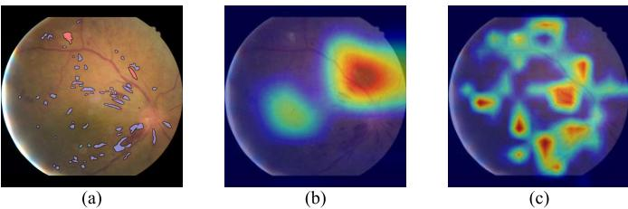
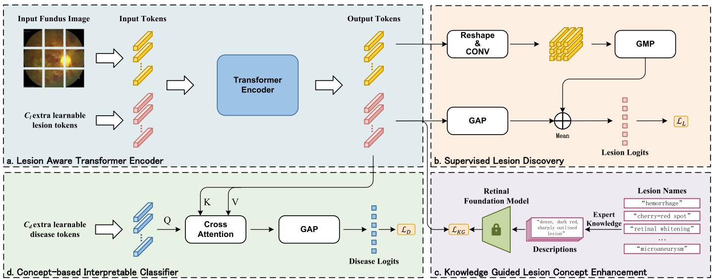
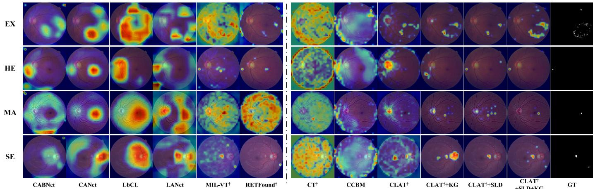
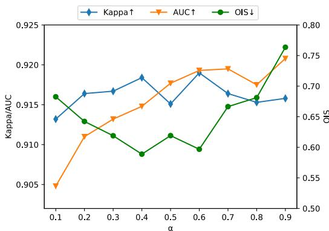
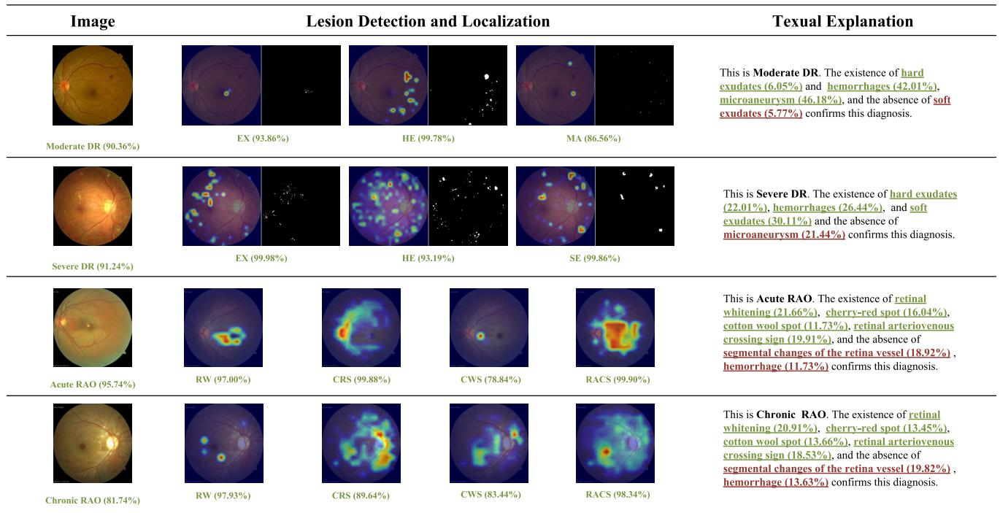
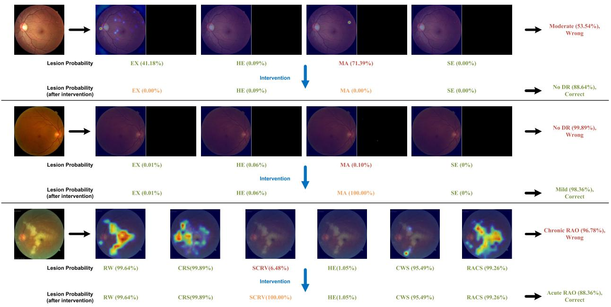

# Concept-Based Lesion Aware Transformer for Interpretable Retinal Disease Diagnosis

Chi Wen , Mang $\mathsf { Y e } ^ { \mathbb { \oplus } }$ , Senior Member, IEEE, He $\mathsf { L i } ^ { \mathbb { \oplus } }$ , Ting Chen, and Xuan Xiao

Abstract— Existing deep learning methods have achieved remarkable results in diagnosing retinal diseases, showcasing the potential of advanced AI in ophthalmology. However, the black-box nature of these methods obscures the decision-making process, compromising their trustworthiness and acceptability. Inspired by the concept-based approaches and recognizing the intrinsic correlation between retinal lesions and diseases, we regard retinal lesions as concepts and propose an inherently interpretable framework designed to enhance both the performance and explainability of diagnostic models. Leveraging the transformer architecture, known for its proficiency in capturing long-range dependencies, our model can effectively identify lesion features. By integrating with image-level annotations, it achieves the alignment of lesion concepts with human cognition under the guidance of a retinal foundation model. Furthermore, to attain interpretability without losing lesion-specific information, our method employs a classifier built on a cross-attention mechanism for disease diagnosis and explanation, where explanations are grounded in the contributions of human-understandable lesion concepts and their visual localization. Notably, due to the structure and inherent interpretability of our model, clinicians can implement concept-level interventions to correct the diagnostic errors by simply adjusting erroneous lesion predictions. Experiments conducted on four fundus image datasets demonstrate that our method achieves favorable performance against state-of-the-art methods while providing faithful explanations and enabling conceptlevel interventions. Our code is publicly available at https://github.com/Sorades/CLAT.

Index Terms— Interpretability, concepts, fundus image, transformer, attention mechanism.

macular degeneration (AMD), and pathological myopia (PM). With the advancement of deep learning, deep neural networks (DNNs) have been widely applied to assist ophthalmologists in diagnosing these retinal diseases automatically by learning the discriminative features from fundus images through large-scale datasets and sophisticated architectures, such as Convolutional Neural Networks (CNNs) and Vision Transformers (ViTs). These models have demonstrated remarkable accuracy and performance in various retinal disease diagnosis tasks [1], [2], [3], [4], [5], [6], [7], [8]. However, these DNN-based approaches are rarely applied in clinical practice, mainly due to the black-box nature of deep learning. Given that medical diagnosis demands a profound understanding of the domain knowledge, having decisions that are not comprehensible to human experts is unacceptable. This lack of transparency would undermine the trust of doctors [9]. To address this issue, various strategies [10], [11] have been proposed to help people understand the decision-making process of deep neural networks. Currently, the explanation of medical image analysis models mainly relies on saliency maps, which highlight the regions of an image that the model deems important for making predictions [12], [13]. Despite being widely used, some studies [14], [15], [16] have revealed that the saliency maps generated by these methods could be inconsistent for misclassified samples.

#

I. INTRODUCTIONF UNDUS images are indispensable in diagnosing retinaldiseases, such as diabetic retinopathy (DR), age-related

Manuscript received 7 June 2024; accepted 11 July 2024. Date of publication 16 July 2024; date of current version 2 January 2025. This work was supported in part by the National Natural Science Foundation of China under Grant 62361166629, in part by the Key Research and Development Project of Hubei Province under Grant 2022BAD175 and Grant 2022BCA009, and in part by the Interdisciplinary Innovative Talents Foundation from Renmin Hospital of Wuhan University. (Corresponding authors: Mang Ye; Xuan Xiao.)

Chi Wen and He Li are with the School of Computer Science, Wuhan University, Wuhan 430072, China (e-mail: wenchi@whu.edu.cn; lihe404@whu.edu.cn).

Mang Ye is with the School of Computer Science and the Taikang Center for Life and Medical Sciences, Wuhan University, Wuhan 430072, China (e-mail: yemang@whu.edu.cn).

Ting Chen and Xuan Xiao are with the Department of Ophthalmology, Renmin Hospital of Wuhan University, Wuhan 430060, China (e-mail: ct19870629@hotmail.com; xiaoxuan1111@whu.edu.cn). Digital Object Identifier 10.1109/TMI.2024.3429148

Recently, concept-based approaches [17], [18] have attracted much attention in the field of explainable AI. Researchers have started applying these approaches to medical image analysis [19], [20], [21], [22], leveraging concepts that align with human cognition to explain the decision-making process of the model. This not only enhances interpretability but also more faithfully reflects the actual decision-making process of the model. Typically, these approaches involve a DNN-based model with an additional bottleneck layer inserted between the backbone and classifier head. This layer is designed to extract concepts from the input data by enforcing specific filters of the bottleneck to be activated when particular concepts are present. The classifier head then leverages these comprehensible concepts for the final prediction. This paradigm ensures the decision-making process of the model to be easily and faithfully explained through the contributions of these concepts.

There have been several studies trying to integrate lesion information into model training, aiming to enhance the performance of retinal disease diagnosis [2], [4], [23], [24]. Inspired by this perspective, we propose to treat lesions as concepts and apply a concept-based framework to develop an inherently interpretable model for retinal disease diagnosis. As depicted in Fig. 1(a), retinal lesions exhibit significant variability in morphology, size, location, texture, and color, with often multiple lesion types appearing sparsely distributed within a single fundus image. Given these complexities, we posit that transformers, known for their adeptness at capturing long-range dependencies [25], are inherently better suited for identifying these retinal lesions compared to CNNs. This is further supported by the comparative visualization of attention regions by CNN and transformer, as shown in Fig. 1(b)(c), respectively. Motivated by this understanding, we introduce a novel transformer-based model for retinal lesion concept learning. By leveraging the strengths of transformer in capturing long-range dependencies, our approach captures lesion information more accurately, leading to better diagnostic performance and interpretability.

  
Fig. 1. (a) A sample fundus image with different lesions annotated in different colors. (b) Visualization of attention region of CNN. (c) Visualization of attention region of transformer.

In this paper, we introduce the Concept-based Lesion Aware Transformer (CLAT), a novel framework for interpretable retinal disease diagnosis from fundus images. CLAT treats retinal lesions as concepts, aligning model decisions with clinically relevant lesion characteristics. This approach not only enhances model transparency but also leverages the transformer’s capability to capture the sparsely distributed retinal lesions, offering a significant advantage over CNNs. For more discriminative representation and explicit utilization of learned lesion concepts, CLAT employs multiple learnable tokens to represent each lesion. This method surpasses traditional concept-based approaches, which encode concept representations from extracted image feature, in capturing the representation of concepts more effectively. Recognizing the limitations of supervised learning, which often focuses on the most discriminative features at the expense of the semantic correlations inherent in human cognition, our approach extends beyond by leveraging a retinal foundation model [26]. We integrate image-level lesion annotations for initial feature learning and introduce a novel knowledge guided enhancement strategy to align these features with medical domain knowledge extracted from a retinal foundation model, ensuring that the model’s understanding of lesions aligns with human expertise. An innovative interpretable classifier, employing a cross-attention mechanism between learnable disease tokens and lesion tokens, enables the output of disease classification logits. The attention weights then serve as a direct measure of contribution of each lesion to specific disease diagnosis result, providing concept-based explanations for decisionmaking process of the model. After training, CLAT only requires a fundu image for input to diagnose retinal disease, providing explanations based on retinal lesions. If diagnostic errors occur due to erroneous lesion predictions, interventions can be applied to correct these errors. Four datasets are used to evaluate the performance of CLAT in terms of retinal disease diagnosis and interpretability, including the FGADR dataset [27], a subset of the DDR dataset [28], a private dataset, and the FGADDR dataset which is a merge of FGADR and DDR-subset. Our contributions are summarized as follows:

• We develop a novel lesion aware transformer encoder and a concept-based interpretable classifier, leveraging retinal lesions to improve diagnostic performance, provide concept-based explanations, and enable concept-level intervention to correct diagnostic errors. • We introduce image-level lesion supervision and knowledge guided lesion concept enhancement strategy based on a retinal foundation model, effectively aligning the lesion representation with medical domain knowledge, thus enhancing both accuracy and reliability of the model. We conduct extensive experiments on four datasets, and the results demonstrate that our strategy is capable of not only achieving favorable performance against state-ofthe-art methods but also providing faithful explanations for the decision-making process of the model.

# II. RELATED WORK

# A. DNN-Based Disease Diagnosis From Fundus Images

The success of DNN-based approaches in various computer vision applications has motivated researchers to employ deep learning for retinal disease diagnosis from fundus images [1], [2], [3], [4], [5], [6], [7], [23]. Early works mainly focused on the exploration of CNN architectures and the end-to-end training of models using image-level annotations, aiming to achieve high accuracy in retinal disease diagnosis. For example, [5] introduced the Inception architecture for DR grading, while [7] proposed a transfer learning approach, transferring a pre-trained model of natural image classification for fundus image classification. These methods solely relied on data-driven training of CNN architectures, lacking specific operations to encode the retinal-specific characteristics of fundus images.

To enhance performance in fine-grained retinal disease grading, some researchers started to leverage the lesion information to assist the model in disease diagnosis, especially in DR grading tasks. Reference [1] introduced a system that integrates fundus image quality assessment, lesion segmentation, and disease grading, leveraging lesion details for improved grading. Reference [29] adopted a multi-task framework to jointly perform image super-resolution, lesion segmentation, and DR grading. The lesion mask obtained from the segmentation subnet is used to enhance the performance of DR grading. These works have demonstrated that fusing lesion information into identification of retinal diseases can effectively improve model performance. However, they all require pixel-level or box-level annotations, making it difficult to apply these methods in clinical practice.

Several studies leverage lesion information in retinal diagnosis without relying on explicit lesion annotations. Reference [2] employed an auxiliary classifier and Class Activation Maps (CAM) [10] for lesion-sensitive feature extraction in DR diagnosis. Reference [30] used a pre-trained lesion detector to create samples, applied contrastive learning to refine difficult cases, and fine-tuned for DR grading. Although it achived good performance, the method’s complexity and need for annotations limit its ease of use. Some works focus on localizing suspicious lesion regions using attention mechanisms or weakly supervised learning, such as [3], [4], [23], [31], and [32]. However, these methods still use CNNs as the main feature extractor, potentially resulting in neglecting the sparser distribution of lesions characteristic. Reference [33] delved into transformers for retinal lesion detection, showing enhanced capability in feature extraction. However, without targeted lesion supervision, the model cannot distinguish different lesion features. In addition, none of the aforementioned methods can explain their decisions well, and all suffer from the black-box nature of deep networks. Reference [34] yields visual evidences of abnormalities to achieve interpretability, yet, like saliency maps, faces the inconsistenices with diagnostic results.

Our method is based on the transformer architecture, adept at capturing the retinal lesions with long-range dependencies. Taking inspiration from concept-based learning, we treat retinal lesions as concepts and base the final diagnosis on these lesion concepts, which not only improves the performance of the model but also enables the model inherently interpretable.

# B. Concept-Based Models

Concept-based models is a recent advancement in the field of interpretability. The principle idea of these approaches is to design methods that explain predictions with high-level human-understandable concepts. Concept bottleneck models (CBMs) [17] are one of the most representative works in this field. These models typically create a layer before the classifier to extract human-understandable concepts from the feature maps of the backbone. CBMs have proven effective in developing models with intrinsic interpretability. However, training CBMs demands labeled data for each concept, making it more challenging to implement. To address this issue, [35] proposed a label-free CBM by leveraging GPT [36] and CLIP [37] to generate concept labels for input data. Since the CBMs are of ante-hoc, [38] proposed PCBM that can convert any pre-trained model into a CBM, which is done by employing Concept Activation Vector (CAV) [39] or CLIP. CAVs offer an alternative approach to integrating concepts into models. These methods apply linear classifiers to a network’s features to test their ability to distinguish human-understandable concept examples, with the classifiers’ coefficients identified as CAVs.

Some efforts have been made to apply concept-based approaches to medical image analysis. Based on CAVs [19] proposed Regression Concept Vector to provide continuous-valued measures for concepts in the application of breast histopathology and retinopathy of prematurity diagnosis. Reference [20] introduced a framework relied on CAVs to provide multimodal concept-based explanations for melanoma classification. To overcome the annotation dependency [40] proposed a framework that discovers pseudo-concepts first and enhances performance by incorporating the features of these visual concepts. More recently, [22] proposed a method based on CBM that effectively enhances the visual explanation performance for skin lesion diagnosis by guiding concept filters with related image regions. Reference [21] proposed a framework based on CBM that allows physicians to intervene in the decisions of the trained model to improve the trustworthiness of skin cancer diagnosis models.

While these methods have demonstrated the efficacy of concept-based approaches in specific medical image analysis applications, there have been no attempts to treat retinal lesions as concepts and apply concept-based methods to the inherently interpretable models for retinal disease diagnosis. To address this, we present an inherently interpretable concept-based retinal disease diagnosis model, wherein the provided explanations faithfully reflect the decision rationale. Notably, our approach adopts a novel transformer-based architecture, which has better performance in extracting information related to retinal lesion concepts. This attribute makes it more suited to the practical application of retinal disease diagnosis.

# III. METHOD

# A. Overview

Fundus imaging is one of the most commonly used tools for retinal disease diagnosis. The retinal disease diagnosis task aims to predict the type or severity of retinal diseases based on fundus images, which is a multi-class classification problem. Given a fundus image $x$ , the standard diagnostic model $f$ is required to output the disease diagnosis ${ \tt y } _ { d }$ , which can be formulated as $\mathsf { y } _ { d } ~ = ~ f ( x )$ , with the causal graph $x $ ${ \tt y } _ { d }$ . To improve interpretability, we adopt the concept-based approach by introducing lesion concepts ${ \tt y } _ { l }$ . This involves first predicting the retinal lesions, which is a multi-label classification problem, and then enabling diagnosis based on these lesion concepts. The causal graph for this concept-based approach is $x  \mathrm { y } _ { l }  \mathrm { y } _ { d }$ , ensuring consistency between lesion concept explanations and disease diagnosis.

In the clinic, ophthalmologists typically rely on their clinical experience and domain knowledge to identify retinal lesions, which form the basis of their diagnoses. To mimic the diagnostic process of human experts and achieve interpretable retinal disease diagnosis, we leverage lesion concepts to deliver high-accuracy diagnostic performance and faithful decision explanations. This enables ophthalmologists to understand the decision-making process of the model, thereby making the model trustworthy and reliable in real clinical practice. Fig. 2 shows the overall architecture of CLAT. We utilize multiple lesion tokens to represent different lesion concepts and use image-level annotations for learning discriminative lesion features. To align these learned features with domain knowledge, a retinal foundation model is employed to guide the learning process. These modules achieve the $x  \mathsf { y } _ { l }$ part of the causal graph. Finally, a novel interpretable classifier, based on a crossattention mechanism, is introduced to enable disease diagnosis based on lesion concepts while providing faithful explanations, realizing the ${ \tt y } _ { l }  { \tt y } _ { d }$ part of the causal graph. Each module of CLAT is detailed in the following sections.

  
Fig. 2. The architecture of our proposed concept-based lesion aware transformer (CLAT). (a) shows the Lesion Aware Transformer Encoder with multiple learnable lesion tokens to represent different lesion concepts, facilitating the learning of discriminative features and enabling the explicit utilization of lesion information. (b) shows the Supervised Lesion Discovery module, which leverages image-level lesion annotations to supervise lesion concept learning and a strategy that aggregates the patch tokens to enhance the local context of the lesion tokens. (c) shows the Knowledge Guided Lesion Concept Enhancement module, which leverages the domain knowledge of the retinal foundation model to guide the lesion concept learning. (d) shows the Concept-based Interpretable Classifier, which utilizes the rich retinal lesion concept information learned by the model to achieve accurate and explainable disease diagnosis with concept-based explanations.

# B. Lesion Aware Transformer Encoder

To effectively represent retinal lesions, and to explicitly utilize these lesion representations for disease diagnosis, we introduce the Lesion Aware Transformer Encoder. It utilizes multiple learnable lesion tokens to represent different lesion concepts, which is inspired by the MCT-former [41]. This is a significant advancement over conventional methods, enabling the model to capture the nuanced features of retinal lesions more effectively. As illustrated in Fig. 2, the input fundus image is split into $N \times N$ patches, which are then embedded into a sequence of patch tokens $\mathbf { T } _ { p } ~ \in ~ \mathbb { R } ^ { M \times D }$ where $D$ denotes the embedding dimension, and $M = N ^ { 2 }$ . We additionally create $C _ { l }$ learnable lesion tokens $\mathbf { T } _ { l } \in \mathbb { R } ^ { C _ { l } \times D }$ where $C _ { l }$ is the number of lesion types. With the added learnable position embeddings, these tokens are concatenated and then fed into the transformer encoder.

This design allows each lesion token to interact with patch tokens through the transformer’s self-attention mechanism, effectively capturing the long-range dependencies that are the key for identifying sparsely distributed lesions in fundus images. This approach not only facilitates the learning of more discriminative features but also enables the explicit utilization of lesion information. Consequently, it leads to a lesion-aware feature extraction process, significantly enhancing the encoder’s ability to identify and characterize lesions.

# C. Supervised Lesion Discovery

Upon processing through the Lesion Aware Transformer Encoder, the output lesion tokens $\mathbf { T } _ { o u t _ { l } } ~ \in ~ \mathbb { R } ^ { C _ { l } \times D }$ engage in interaction with each patch token via the transformer’s attention mechanism. This interaction enables the lesion tokens to capture comprehensive lesion information at the patch level, facilitating their understanding of global long-range dependencies associated with lesion features. However, they fall short in extracting the local details of fundus image, which are important when dealing with retinal lesions in small scale.

To bridge this gap, we focus on enhancing the representation of local lesion information. To actualize this, we first reshape the output patch tokens $\mathbf { T } _ { o u t _ { p } } ~ \in ~ \mathbb { R } ^ { M \times D }$ back into $N \times N$ patches and then project them to the same dimensionality as the lesion tokens using aaggregated patch tokens $1 \times 1$ l layer to obtain the. To underscore the $\mathbf { T } _ { o u t _ { p } } ^ { \prime } \in \mathbb { R } ^ { N \times N \times C _ { l } }$ local details further, global max pooling (GMP) is utilized for the aggregated patch tokens, focusing on the most prominent features. Concurrently, global average pooling (GAP) aggregates the lesion tokens, maintaining a balance between local and global context. This dual pooling strategy leverages the transformer’s strength in capturing long-range dependencies while enhancing the local information representation provided by the aggregated patch tokens. The final lesion logits can be obtained as:

$$
\hat { \mathbf { y } } _ { l } = \frac { 1 } { 2 } ( G M P ( \mathbf { T } _ { o u t _ { p } } ^ { \prime } ) + G A P ( \mathbf { T } _ { o u t _ { l } } ) ) .
$$

This module ends up with a multi-label soft margin loss between the lesion logits and the image-level lesion annotations $\mathbf { y } _ { l }$ :

$$
\mathcal { L } _ { L } = - \frac { 1 } { C _ { l } } \sum _ { i = 1 } ^ { C _ { l } } \mathbf { y } _ { l } ^ { i } \log \sigma ( \hat { \mathbf { y } } _ { l } ^ { i } ) + ( 1 - \mathbf { y } _ { l } ^ { i } ) \log ( 1 - \sigma ( \hat { \mathbf { y } } _ { l } ^ { i } ) ) .
$$

It is worth noting that the $\mathcal { L } _ { L }$ loss is the objective function for the supervised learning of lesion tokens, which is a multi-label classification problem, and not the loss for disease diagnosis.

# D. Knowledge Guided Lesion Concept Enhancement

While the supervised learning of lesion tokens effectively identifies features that are discriminative for lesion discovery, it often overlooks the alignment with lesion concepts as comprehended in human medical practice. To address this issue, we propose the Knowledge Guided Lesion Concept Enhancement strategy, which emphasizes the integration of extensive domain knowledge in medicine to guide the learning of lesion concepts, aiming to yield representations that are aligned with human-understandable concepts. Inspired by [42], we adopt the perspective that such knowledge can be effectively sourced from a medical foundation model. For this purpose, we employ a pre-trained text encoder with medical knowledge to obtain the knowledge embeddings of lesion concepts.

Practically, we directly employ an off-the-shelf model, FLAIR [26], a foundation language-image model of retina. We first utilize its expert knowledge descriptor, denoted as $\pi _ { E K }$ , to obtain the descriptions of the lesions that are consistent with medical knowledge such that $\{ \mathbf { D } ^ { * } \} _ { 1 } ^ { P } = \pi _ { E K } ( \mathbf { n } ^ { * } )$ where $\{ \mathbf { D } ^ { * } \} _ { 1 } ^ { P }$ is a set of descriptions of a specific lesion name $\mathbf { n } ^ { * }$ and $P$ is the number of descriptions which might differ from one lesion to another. This approach enables the more effective utilization of medical knowledge beyond mere lesion names. Then we take the advantage of the text encoder of FLAIR to embed the lesions and their descriptions to knowledge embeddings:

$$
\mathbf { E } _ { i } = \Phi _ { k } ( \pi _ { E K } ( \mathbf { n } ^ { i } ) ) \in \mathbb { R } ^ { D _ { k } } ,
$$

where $\mathbf { E } _ { i }$ is the embedding of the $i$ -th lesion, $\mathbf { n } ^ { i }$ denotes the $i$ - th lesion name, $\Phi _ { k }$ is the text encoder of the foundation model, and $D _ { k }$ is the dimensionality of the knowledge embeddings.

These knowledge embeddings are then frozen and used for guiding the learning of lesion tokens. We first employ an adapter $\Phi _ { a }$ to project the lesion tokens to the same dimensionality as the knowledge embeddings, and then calculate the similarity between the lesion tokens and the knowledge embeddings, forming a similarity matrix S:

$$
\mathbf { S } = \boldsymbol { \Phi } _ { a } ( \mathbf { T } _ { o u t _ { l } } ) \cdot \mathbf { E } ^ { T } \in \mathbb { R } ^ { C _ { l } \times C _ { l } } .
$$

To encourage similarity between the lesion tokens and their corresponding knowledge embeddings, we apply a cross-entropy loss between the similarity matrix and an identity matrix $\dot { \mathbf { I } } \in \mathbb { R } ^ { C _ { l } \times C _ { l } }$ :

$$
\mathcal { L } _ { K G } = - \frac { 1 } { C _ { l } ( \sum _ { i = 1 } ^ { C _ { l } } \mathbf { y } _ { l } ^ { i } + \epsilon ) } \sum _ { i = 1 } ^ { C _ { l } } \mathbf { y } _ { l } ^ { i } \mathbf { I } ^ { i } \log \frac { \exp ( \mathbf { S } ^ { i } ) } { \sum _ { j = 1 } ^ { C _ { l } } \exp ( \mathbf { S } ^ { j } ) } ,
$$

where $\epsilon$ is a small constant to avoid numerical instability. The lesion labels here serve to prevent the model from inappropriately aligning inactive lesion tokens with knowledge embeddings when the lesion is absent.

# E. Concept-Based Interpretable Classifier

Having aligned lesion tokens with human medical knowledge through our methods, we now focus on utilizing these tokens for disease diagnosis. Traditional concept-based approaches directly derive the concept activation values by pooling the concept features and use a sparse linear classifier for final predictions and explanations. While effective in certain applications, these methods are insufficient for retinal disease diagnosis. This is because accurate retinal diagnosis requires not only identifying the presence of lesions but also understanding specific lesion features. To this end, we propose the Concept-based Interpretable Classifier, utilizing the rich retinal lesion concept information learned by the model to achieve accurate and explainable disease diagnosis.

Specifically, for each disease type, we create a learnable CLS token $\dot { \mathbf { T } } _ { d } \in \mathbb { R } ^ { C _ { d } \times D }$ , termed as the disease token, with the same dimensionality as the lesion tokens and $C _ { d }$ denotes the number of disease types. The disease tokens are used to represent the disease-specific information. Inspired by the ConceptTransformer [43], we perform cross-attention between $\mathbf { T } _ { d }$ and $\mathbf { T } _ { o u t _ { l } }$ , treating disease tokens as queries and the lesion tokens as keys and values. Mathematically, this process can be formulated as follows:

$$
\begin{array} { r l } & { \mathbf { Q } = \mathbf { T } _ { d } \mathbf { W } _ { q } , \mathbf { K } = \mathbf { T } _ { o u t _ { l } } \mathbf { W } _ { k } , \mathbf { V } = \mathbf { T } _ { o u t _ { l } } \mathbf { W } _ { v } , } \\ & { \mathbf { A } = s o f t m a x ( \frac { 1 } { \sqrt { D } } \mathbf { Q } \mathbf { K } ^ { T } ) \in \mathbb { R } ^ { C _ { d } \times C _ { l } } , } \\ & { \hat { \mathbf { y } } _ { d } = G A P ( \mathbf { A } \mathbf { V } ) , } \end{array}
$$

where ${ \bf W } _ { q } , { \bf W } _ { k } , { \bf W } _ { v } \quad \in \quad \mathbb { R } ^ { D \times D }$ are learnable parameters, (c $2 , \mathbf { K } , \mathbf { V } \ \in \ \mathbb { R } ^ { C _ { d } \times D }$ are the query, key, and value matrices, respectively, and $\mathbf { A }$ is the attention weight matrix. For simplicity, we describe a single-head cross-attention here, but a multi-head version is used in our experiments.

According to Equation (8), given an input $x$ to the model, the logits of the disease $i$ is computed as $G A P ( [ \mathbf { A } _ { i , : } \mathbf { T } _ { o u t _ { l } } ] )$ , which implies that the disease logits are the weighted sum of the lesion tokens and the attention weights in $\mathbf { A }$ indicate the contribution of specific lesions to the prediction of specific diseases. This ensures that the concept-based explanations provided by the model for its predictions are faithful to the lesion concept.

We finally compute the cross-entropy loss between the disease logits ${ \hat { \mathbf { y } } } _ { d }$ and disease annotations ${ \bf y } _ { d }$ :

$$
\mathcal { L } _ { D } = - \frac { 1 } { C _ { d } } \sum _ { i = 1 } ^ { C _ { d } } \mathbf { y } _ { d } ^ { i } \log \frac { \exp ( \hat { \mathbf { y } } _ { d } ^ { i } ) } { \sum _ { j = 1 } ^ { C _ { d } } \exp ( \hat { \mathbf { y } } _ { d } ^ { j } ) } .
$$

The total loss combines the lesion discovery loss $\mathcal { L } _ { L }$ , the knowledge guided loss $\mathcal { L } _ { K G }$ , and the disease classification loss $\mathcal { L } _ { D }$ :

$$
\begin{array} { r } { \mathcal { L } = \mathcal { L } _ { L } + \alpha \mathcal { L } _ { D } + ( 1 - \alpha ) \mathcal { L } _ { K G } . } \end{array}
$$

where $\alpha$ is the hyperparameter controlling the weight of the knowledge guided loss and the disease loss.

# IV. EXPERIMENTS

# A. Experimental Settings

1) Datasets: We conduct experiments on four datasets, including FGADR [27], DDR [28], FGADDR (merged from FGADR and DDR), and a private dataset. The FGADR, DDR, and FGADDR datasets are focused on Diabetic Retinopathy (DR) grading, each annotated with 5 grades of DR and

TABLE I THE DISTRIBUTION OF DISEASE AND LESION ANNOTATIONS IN THE FOUR DATASETS. EX: EXUDATES; HE: HEMORRHAGES; MA: MICROANEURYSM; SE: SOFT EXUDATES; RW: RETINAL WHITENING; CRS: CHERRY-RED SPOT; SCRV: SEGMENTAL CHANGES OF THE RETINA VESSEL; CWS: COTTON WOOL SPOTS; RACS: RETINAL ARTERIOVENOUS CROSSING SIGN   

<table><tr><td rowspan="2">Dataset</td><td rowspan="2">Total</td><td colspan="5">Disease Labels</td><td colspan="4">Lesion Labels</td></tr><tr><td>No DR</td><td>Mild</td><td>Moderate</td><td>Severe</td><td>Proliferative</td><td>EX</td><td>HE</td><td>MA</td><td>SE</td></tr><tr><td>FGADDR</td><td>3237</td><td>758</td><td>308</td><td>1138</td><td>680</td><td>353</td><td>1764</td><td>2055</td><td>1993</td><td>865</td></tr><tr><td>FGADR [27]</td><td>1737</td><td>13</td><td>209</td><td>590</td><td>646</td><td>279</td><td>1279</td><td>1456</td><td>1424</td><td>627</td></tr><tr><td>DDR [28]</td><td>1500</td><td>745</td><td>99</td><td>548</td><td>34</td><td>74</td><td>485</td><td>599</td><td>569</td><td>238</td></tr><tr><td rowspan="2">Dataset</td><td rowspan="2">Total</td><td colspan="3">Disease Labels</td><td colspan="5">Lesion Labels</td><td rowspan="2"></td></tr><tr><td>No RAO</td><td></td><td>Chronic</td><td>Acute</td><td></td><td>SCRV</td><td>HE</td><td>CWS</td></tr><tr><td>PrivateData</td><td>689</td><td>401</td><td>42</td><td>246</td><td>RW 264</td><td>CRS 270</td><td>69</td><td>106</td><td>159</td><td>RACS 139</td></tr></table>

4 types of retinal lesions at the image level. The private dataset, designated for Retinal Artery Occlusion (RAO) grading, is annotated with 3 grades of RAO and 6 types of retinal lesions related to RAO at the image level. Notably, the full DDR dataset comprises 13,673 fundus images, among which a segmentation subset includes 757 images with pixel-level annotations of retinal lesions. To facilitate comparison experiments, we augmented this refined subset with 745 ‘No DR’ images, randomly chosen from the broader DDR grading dataset, resulting in a dataset of 1,500 images. For a more comprehensive evaluation, we merged the FGADR and DDR datasets to construct a larger dataset, named FGADDR. The distribution of disease types and the detailed lesion annotations within these datasets are summarized in Table. I.

2) Implementation Details: All experiments are conducted on an NVIDIA RTX 4090 GPU. To ensure robustness and reliability, we adopt a 10-fold cross-validation strategy across all datasets. An AdamW optimizer is employed, alongside a CosineAnnealingWarmRestarts scheduler with a minimum learning rate set to 1e-6. To avoid overfitting and save training time, we apply early stopping with a patience of 15 epochs. The loss weights are configured as $\alpha = 0 . 6$ , with the number of heads for the cross-attention mechanism set to 8. A batch size of 16, an initial learning rate of 4e-5, and a weight decay of 1e-4 are set. Augmentations such as rotation, horizontal flipping, color jittering, and gaussian glur are applied to the training images. All images are resized to $3 8 4 \times 3 8 4$ before being fed into the models. During the inference phase, CLAT only needs a fundus image as input to generate disease diagnosis results, lesion prediction results, and related explanations, without requiring any additional information or annotations. We adopt the CaiT-xs24 [45] as the backbone of transformerbased models, and ResNet101 [44] for CNN-based models. Most models are initialized using the ImageNet-1k [51] pretrained weights and trained for 200 epochs, while CANet [46], MIL-VT [48], LbCL [47], and RETFound [49] use pre-trained weights on large fundus dataset provided by the authors and are finetuned for 20 epochs. For a fair comparison, we also conduct experiments where CLAT is initialized with the same pre-trained weights as MIL-VT, which is also a transformerbased model.

3) Evaluation Metrics: To evaluate the performance of the proposed method, we employ quadratic weighted kappa (Kappa) [52], Sensitivity, Specificity, and area-under-the-curve (AUC) for the disease grading task. For the multi-label lesion concept prediction task, we use Accuracy, F1-score and AUC to measure the performance.

# B. Comparison With State-of-the-Art Methods

We compare our method against recent advancements in disease grading and CBMs, as detailed in Table II and Table III.

1) Disease Grading Performance: In disease grading, we compare our method with several disease grading models, including CANet [46], CABNet [3], LANet [2], MIL-VT [48], LbCL [47], and RETFound [49], as well as recent CBMs, including CCBM [22], PCBM [38], PCBM-h [38], CT [43], and CEM [50]. According to the results, when using ImageNet pre-trained weights, our method achieves comparable performance to CABNet and LANet, significantly outperforming other CBM methods. When initialized with pre-trained weights on large fundus datasets, our method outperforms all other methods on all datasets, expecially on FGADR, where our method’s Kappa value is $2 . 6 \%$ higher than the secondbest one. It is worth noting that most CBM methods face a trade-off between performance and interpretability, while CLAT achieves comparable or even better performance than other black-box diagnostic models. These experimental results demonstrate the effectiveness of CLAT in disease grading tasks.

2) Lesion Concept Prediction Performance: Our model also excels in comparison with CBMs, outperforming them in both disease grading and lesion concept prediction tasks. Among them, CCBM [22], initially designed for skin lesion diagnosis, does not yield satisfactory results when adapted for retinal lesions. This is because CCBM’s oversimplified pooling of lesion representation to indicate the presence or absence of a lesion is unreasonable for retinal disease diagnosis, as the occurrence of the same lesions may lead to different disease grades. In contrast, our classifier, based on a cross-attention mechanism, effectively utilizes the complete representation information of retinal lesions, thereby capturing the more complex relationship between lesions and disease diagnosis. PCBM [38] and PCBM-h [38], which convert pre-trained models into CBMs, fall short in effectively leveraging lesion information during training, adversely affecting the performance of the final prediction as mentioned in their paper.

TABLE II COMPARISON OF OUR METHOD AGAINST STATE-OF-THE-ART DISEASE GRADING MODELS AND CONCEPT-BASED MODELS (CBMS) ON DISEASE GRADING ACROSS THE FGADDR, FGADR, DDR-SUBSET AND PRIVATE DATASET. THE REPORTED RESULTS ARE THE MEAN VALUES OF 10-FOLD CROSS-VALIDATION (UNIT:%). \* INDICATES THE MODELS ARE INITIALIZED WITH PRE-TRAINED WEIGHTS ON LARGE FUNDUS DATASET. † INDICATES THE TRANSFORMER-BASED MODEL. BOLD INDICATES THE OPTIMAL PERFORMANCE, AND UNDERLINE INDICATES SUBOPTIMAL PERFORMANCE. SENS: SENSITIVITY. SPEC: SPECIFICITY   

<table><tr><td rowspan="2">Models</td><td colspan="4">FGADDR</td><td colspan="4">FGADR</td><td colspan="4">DDR-subset</td><td colspan="4">Private Data</td></tr><tr><td>AUC</td><td>Kappa</td><td>Sens</td><td>Spec</td><td>AUC</td><td>Kappa</td><td>Sens</td><td>Spec</td><td>AUC</td><td>Kappa</td><td>Sens</td><td>Spec</td><td>AUC</td><td>Kappa</td><td>Sens</td><td>Spec</td></tr><tr><td>ResNet101 [44]</td><td>93.42</td><td>88.98</td><td>78.25</td><td>94.56</td><td>88.23</td><td>80.48</td><td>74.73</td><td>93.68</td><td>91.99</td><td>86.28</td><td>83.73</td><td>95.93</td><td>92.94</td><td>90.59</td><td>90.55</td><td>95.27</td></tr><tr><td>CaiT-xs24† [45]</td><td>93.14</td><td>89.48</td><td>78.99</td><td>94.75</td><td>88.74</td><td>81.18</td><td>73.11</td><td>93.28</td><td>90.75</td><td>87.44</td><td>83.63</td><td>95.91</td><td>89.89</td><td>92.45</td><td>91.67</td><td>95.83</td></tr><tr><td>CABNet [3]</td><td>94.43</td><td>90.28</td><td>79.86</td><td>94.96</td><td>89.25</td><td>83.32</td><td>76.68</td><td>94.17</td><td>94.03</td><td>89.53</td><td>85.85</td><td>96.46</td><td>94.49</td><td>93.92</td><td>93.36</td><td>96.68</td></tr><tr><td>CANet* [46]</td><td>94.16</td><td>89.58</td><td>79.02</td><td>94.76</td><td>87.73</td><td>80.78</td><td>74.84</td><td>93.71</td><td>94.02</td><td>88.12</td><td>85.60</td><td>96.40</td><td>94.58</td><td>90.70</td><td>91.87</td><td>95.94</td></tr><tr><td>LbCL* [47]</td><td>94.80</td><td>91.00</td><td>81.12</td><td>95.28</td><td>87.09</td><td>82.12</td><td>77.09</td><td>94.27</td><td>93.64</td><td>90.58</td><td>87.00</td><td>96.75</td><td>94.48</td><td>93.19</td><td>92.92</td><td>96.46</td></tr><tr><td>MIL-VT*† [48]</td><td>95.01</td><td>90.13</td><td>79.89</td><td>94.97</td><td>91.68</td><td>81.07</td><td>76.04</td><td>94.01</td><td>94.25</td><td>89.14</td><td>86.47</td><td>96.62</td><td>94.88</td><td>93.90</td><td>93.61</td><td>96.81</td></tr><tr><td>RETFound*† [49]</td><td>92.83</td><td>88.78</td><td>76.95</td><td>94.24</td><td>88.60</td><td>82.34</td><td>74.55</td><td>93.64</td><td>90.60</td><td>86.71</td><td>83.47</td><td>95.87</td><td>92.34</td><td>94.54</td><td>93.47</td><td>96.73</td></tr><tr><td>LANet [2]</td><td>94.29</td><td>90.94</td><td>80.17</td><td>95.04</td><td>89.46</td><td>83.68</td><td>76.80</td><td>94.20</td><td>93.41</td><td>90.11</td><td>87.00</td><td>96.75</td><td>91.78</td><td>94.79</td><td>94.20</td><td>97.10</td></tr><tr><td>CCBM [22]</td><td>90.80</td><td>88.64</td><td>76.09</td><td>94.02</td><td>75.51</td><td>78.95</td><td>73.11</td><td>93.28</td><td>87.20</td><td>82.56</td><td>83.13</td><td>95.78</td><td>92.07</td><td>90.37</td><td>91.00</td><td>95.50</td></tr><tr><td>PCBM [38]</td><td>86.85</td><td>76.68</td><td>66.13</td><td>91.53</td><td>84.27</td><td>67.41</td><td>63.25</td><td>90.81</td><td>77.78</td><td>76.31</td><td>74.93</td><td>93.73</td><td>89.85</td><td>84.42</td><td>87.52</td><td>93.76</td></tr><tr><td>PCBM-h [38]</td><td>92.71</td><td>87.40</td><td>78.79</td><td>94.70</td><td>90.19</td><td>78.39</td><td>71.50</td><td>92.87</td><td>81.79</td><td>80.48</td><td>76.87</td><td>94.22</td><td>87.36</td><td>88.52</td><td>90.42</td><td>95.21</td></tr><tr><td>CT+ [43]</td><td>91.13</td><td>86.96</td><td>74.98</td><td>93.74</td><td>85.51</td><td>75.53</td><td>70.24</td><td>92.56</td><td>85.12</td><td>79.65</td><td>81.13</td><td>95.28</td><td>92.05</td><td>89.63</td><td>90.58</td><td>95.29</td></tr><tr><td>CEM [50]</td><td>93.82</td><td>89.07</td><td>78.04</td><td>94.51</td><td>89.81</td><td>81.36</td><td>74.55</td><td>93.64</td><td>92.91</td><td>88.79</td><td>85.60</td><td>96.40</td><td>91.81</td><td>93.32</td><td>92.45</td><td>96.23</td></tr><tr><td>CLAT†(Ours)</td><td>94.21</td><td>90.47</td><td>79.03</td><td>94.76</td><td>89.30</td><td>83.11</td><td>75.53</td><td>93.88</td><td>86.68</td><td>88.66</td><td>84.93</td><td>96.23</td><td>91.70</td><td>94.36</td><td>93.06</td><td>96.53</td></tr><tr><td>CLAT-pretrain(Ours)*†</td><td>94.81</td><td>91.90</td><td>81.93</td><td>95.48</td><td>87.34</td><td>85.08</td><td>78.24</td><td>94.56</td><td>94.21</td><td>91.46</td><td>87.20</td><td>96.80</td><td>95.78</td><td>94.95</td><td>93.76</td><td>96.88</td></tr></table>

TABLE III COMPARISON OF OUR METHOD AGAINST STATE-OF-THE-ART CONCEPT-BASED MODELS (CBMS) ON LESION CONCEPT PREDICTION ACROSS THE FGADDR, FGADR, DDR-SUBSET AND PRIVATE DATASET. \* INDICATES THE MODELS ARE INITIALIZED WITH PRE-TRAINED WEIGHTS ON LARGE FUNDUS DATASET. $^ \dagger$ INDICATES THE TRANSFORMER-BASED MODEL. THE REPORTED RESULTS ARE THE MEAN VALUES OF 10-FOLD CROSS-VALIDATION (UNIT: $\%$ ). BOLD INDICATES THE OPTIMAL PERFORMANCE, AND UNDERLINE INDICATES SUBOPTIMAL PERFORMANCE. ACC: ACCURACY. F1: F1-SCORE   

<table><tr><td rowspan="3">Models</td><td colspan="3">FGADDR</td><td colspan="3">FGADR</td><td colspan="3">DDR-subset</td><td colspan="3">Private Data</td></tr><tr><td>ACC</td><td>AUC</td><td>F1</td><td>ACC</td><td>AUC</td><td>F1</td><td>ACC</td><td>AUC</td><td>F1</td><td>ACC</td><td>AUC</td><td>F1</td></tr><tr><td>CCBM [22]</td><td>65.41</td><td>61.46</td><td>74.69</td><td>73.30</td><td>56.99</td><td>83.41</td><td>55.45</td><td>65.51</td><td>58.44</td><td>48.69</td><td>60.12</td><td>47.15</td></tr><tr><td>PCBM [38]</td><td>72.93</td><td>78.26</td><td>77.21</td><td>55.66</td><td>51.23</td><td>64.64</td><td>83.07</td><td>90.19</td><td>76.31</td><td>79.92</td><td>88.11</td><td>69.33</td></tr><tr><td>CT [43]</td><td>70.51</td><td>66.83</td><td>65.37</td><td>75.07</td><td>68.18</td><td>79.94</td><td>79.43</td><td>69.29</td><td>63.56</td><td>85.33</td><td>66.32</td><td>64.42</td></tr><tr><td>CEM [50]</td><td>80.78</td><td>79.10</td><td>83.41</td><td>68.83</td><td>77.80</td><td>81.53</td><td>84.95</td><td>86.92</td><td>79.83</td><td>87.54</td><td>82.93</td><td>77.14</td></tr><tr><td>CLAT(Ours)</td><td>85.07</td><td>90.51</td><td>85.70</td><td>81.23</td><td>80.32</td><td>86.66</td><td>88.70</td><td>94.07</td><td>81.62</td><td>90.65</td><td>92.06</td><td>79.79</td></tr><tr><td>CLAT-pretrain(Ours)*†</td><td>86.03</td><td>91.93</td><td>86.67</td><td>82.66</td><td>82.86</td><td>87.57</td><td>89.80</td><td>95.16</td><td>83.53</td><td>92.24</td><td>94.51</td><td>83.24</td></tr></table>

The results of CT [43] and CEM [50] are better than CCBM, as they learn concept embeddings for the final prediction instead of using the final lesion logits as the concept bottleneck layer. However, they still lag behind our method by a significant margin, as they do not explicitly model the discriminative lesion features like our method. These results demonstrate the superiority of our method in lesion concept prediction, which is crucial for accurate and interpretable disease diagnosis.

3) Lesion Localization and Visualization: To further evaluate the efficiency and correctness of the CLAT architecture in focusing on lesion regions, we compare its visualization results with other methods on the FGADDR dataset, except for CEM [50] and PCBM [38], due to their unique design for concept embeddings. It is worth noting that we use saliency maps here only to identify the regions the model deems important. Therefore, these visualizations of retinal lesions are not meant to prove the interpretability of CLAT but to demonstrate that CLAT can correctly learn to focus on the corresponding lesion regions even with image-level supervision. As illustrated in Fig. 3, the CNN-based models tend to activate a larger area for disease diagnosis, while the transformer-based models can capture the small and sparse lesion regions better. However, since these black-box models cannot generate visualizations for specific lesions, their saliency maps sometimes involve irrelevant regions or ignore small lesions. The CT [43] and CCBM [22] can generate lesion-specific saliency maps, but their design is not suitable for retinal disease diagnosis, as mentioned in the previous section (IV-B.1). Compared to these models, CLAT is better at identifying small and sparsely distributed abnormal regions, owing to the transformer’s ability to capture long-range dependencies and the discriminative feature learning ability of multiple lesion tokens design.

# C. Ablation Study

1) Efficiency of Concept-Based Lesion Aware Transformer Architecture: The CLAT architecture integrates a lesion-aware transformer encoder with a concept-based interpretable classifier, where the former is responsible for extracting lesionspecific representations, and the latter constructs the linkage between these complex lesion concepts and disease diagnosis. As shown in Table IV, our model demonstrates notable performance in disease grading on the FGADDR dataset, even in the absence of direct lesion annotations. This highlights the transformer-based encoder’s capability to capture lesion-related features from fundus images and the classifier’s effectiveness in utilizing these features for accurate disease diagnosis. After the introduction of lesion information, the model’s attention region is also closer to the ground-truth lesion region, which further demonstrates the superiority of the CLAT framework in lesion identification. Upon the integration of lesion information, there is a noticeable enhancement in the model’s performance, particularly in disease diagnosis and lesion prediction. This improvement signifies the model’s efficiency in leveraging lesion-specific information to improve diagnostic accuracy. Furthermore, the explanations presented in Fig. 5 also illustrate CLAT’s capacity not only to diagnose diseases and identify associated lesions but also to reveal the contributions of lesions to disease diagnosis, establishing CLAT as inherently interpretable. The intervention examples presented in Fig. 6 further underscore the model’s interpretability, as they show the ability of CLAT to modify its decision through the intervention of lesion logits. These attributes equip clinicians with a thorough diagnostic tool, offering reliable and faithful explanations and facilitating interventions for the model’s decision-making process.

  
Fig. 3. Visualization comparison with CAM [10] on FGADDR dataset. The left part of the dashed line is retinal disease diagnosis models, and the right part is concept-based models. Since the black-box models cannot generate visualization for specific lesion, we only show the visualization of predicted disease. $^ \dagger$ indicates the transformer-based model. KG: Knowledge Guided Enhancement. SLD: Supervised Lesion Discovery. GT: Ground Truth.

TABLE IV EVALUATION OF THE EFFECTIVENESS OF EACH MODULE ON THE FGADDR DATASET. THE REPORTED RESULTS ARE THE MEAN VALUES OF 10-FOLD CROSS-VALIDATION (UNIT:%) SLD: SUPERVISED LESION DISCOVERY, KG: KNOWLEDGE GUIDED ENHANCEMENT   

<table><tr><td colspan="2">Module</td><td colspan="2">Disease</td><td colspan="2">Lesion</td></tr><tr><td>CLAT SLD</td><td>KG</td><td>AUC</td><td>Kappa</td><td>AUC</td><td>F1</td></tr><tr><td></td><td></td><td>95.01</td><td>90.13</td><td>/</td><td>/</td></tr><tr><td></td><td></td><td>94.28</td><td>90.70</td><td>51.04</td><td>56.98</td></tr><tr><td></td><td></td><td>94.17</td><td>91.16</td><td>57.30</td><td>61.46</td></tr><tr><td></td><td></td><td>94.41</td><td>91.63</td><td>92.03</td><td>86.73</td></tr><tr><td></td><td></td><td>94.81</td><td>91.90</td><td>91.93</td><td>86.67</td></tr></table>

  
Fig. 4. Evaluation of the hyperparameters $\alpha$ on the FGADDR dataset. We use Kappa to measure the performance of disease grading, AUC for lesion concept prediction, and OIS [53] for the quality of learned lesion tokens. $\uparrow / \downarrow$ indicates that a metric is better if its score is higher/lower.

2) Efficiency of Supervised Lesion Discovery Module: The Supervised Lesion Discovery (SLD) module stands as a crucial component of CLAT’s training, as it introduces lesion annotations at the image-level to guide the model to focus on lesion-related regions during training, thereby learning lesion-specific representations that enable the model to identify and locate retinal lesions. Its integration into CLAT significantly bolsters the model’s performance, particularly in the lesion concept prediction task, as evidenced by the performance improvements in Table IV. From the results in Fig. 4, we can also see that the SLD module plays a significant role in enhancing the performance of lesion prediction. These improvements attests to the SLD module’s efficacy in extracting and processing lesion-specific features, thereby refining the model’s diagnostic accuracy. Beyond enhancing classification metrics, the SLD module plays an instrumental role in enabling CLAT to precisely focus on actual lesion regions within fundus images. This capability is demonstrated in Fig. 3, where the model’s attention regions closely align with the ground-truth of the lesion areas. Such accurate lesion localization not only validates the SLD module’s effectiveness but also significantly contributes to the interpretability of the model. By visualizing the attention regions for specific lesion concepts, CLAT is enabled to provide clinicians with intuitive and clinically relevant insights into the model’s decisionmaking process.

3) Efficiency of Knowledge Guided Enhancement: The Knowledge Guided Enhancement (KG) module is designed to ensure the learning of lesion concepts that are aligned with human cognition, given that the supervised learning only emphasizes the maximum discrimination of lesion representations and ignores the semantic correlation between each lesion concepts. Empirical results from the FGADDR dataset, as presented in Table IV, indicate that integrating the KG module can enhance disease classification performance. This improvement suggests the efficacy of our knowledge guided strategy in directing the model towards identifying and leveraging lesion-relevant features, thereby boosting diagnostic accuracy. As shown in Fig. 4, the KG module also plays a crucial role in enhancing the quality of learned lesion concept representations, as evidenced by the improvement in OIS [53] score with the larger weight of KG module. As illustrated in Fig. 3, the KG module also contributes to the model’s ability to accurately localize and identify lesion regions within fundus images. Furthermore, the attention areas in the $\cdot _ { \mathrm { C L A T + S L D + K G } } ,$ setup are closer to the ground truth compared to ‘CLATzzzzzzz $+ \mathbf { S L D } ^ { \prime }$ , with quantitative metrics also reflecting the KG module’s positive impact on disease diagnosis and lesion prediction performance. This phenomenon can be attributed to the KG module leveraging the semantically rich and generalized text embeddings of related lesions from the foundation model, aiding the concepts that lesion tokens hold in aligning with domain knowledge.

  
Fig. 5. Examples of explanations provided by CLAT on the FGADDR and private dataset. Each row displays the original fundus image, alongside the lesion detection and localization heatmaps produced by CLAT, compared with the corresponding ground-truth annotations. The fundus images are annotated with the predicted disease label and its associated confidence score. Below the heatmaps, the types of lesions identified by CLAT and their respective confidence levels are listed. Accompanying textual explanations quantify the presence and contributions of specific retinal lesions to the overall diagnosis, illustrating CLAT’s comprehensive explanatory capabilities.

4) Hyperparameter Analysis: The hyperparameter $\alpha$ controls the balance between the lesion discovery loss ${ \mathcal { L } } _ { \mathrm { L } }$ and the knowledge guided loss $\mathcal { L } _ { \mathrm { K G } }$ , which are crucial for the performance of the SLD and KG modules. We analyze the impact of $\alpha$ on disease grading, lesion concept prediction, and the quality of learned lesion tokens, using Kappa, AUC, and OIS [53] as evaluation metrics. As shown in Fig. 4, when $\alpha$ increases, the impact of the SLD module gradually dominates, leading to a continual improvement in lesion prediction performance. However, the disease prediction performance first increases and then decreases, and the quality of learned lesion concepts also follows a similar trend. This indicates that the introduction of the SLD module, while enhancing the model’s performance, also affects the quality of the learned concepts, thereby influencing the model’s disease prediction performance. The introduction of the KG module can mitigate this impact to some extent, helping the model learn higher-quality lesion concepts during training, despite the negative impact on disease prediction performance. Thus, there is a trade-off between the performance of lesion prediction and disease prediction. Based on the above analysis, we select $\alpha = 0 . 6$ as the optimal hyperparameter setting.

# D. Interpretability Analysis

1) Explanations Generation: To demonstrate the interpretability of the CLAT model, we present a qualitative analysis using examples of fundus images from the FGADDR dataset and the private dataset. Fig. 5 showcases the model’s ability to detect, localize, and provide textual explanations for various retinal lesions and diseases.

As we can see, CLAT offers a comprehensive diagnostic output, detailing not only the disease diagnosis result and its confidence score, but also the detected retinal lesions and their corresponding confidences. By visualizing the model’s attention regions, lesion areas are accurately localized, aligning closely with pixel-level annotations provided in the dataset. Beyond localization, CLAT utilizes the cross-attention maps computed between diseases and lesions to quantify the contribution of each lesion to the prediction, forming the basis of the model’s textual explanations. It is worth noting that the contribution of lesions and the confidence of lesion detection are different, as the former is calculated based on the attention weights between lesion tokens and disease tokens, while the latter is the sigmoid output of lesion logits. When the lesion detection confidence is lower than $50 \%$ , the corresponding lesion will be considered as absent. According to this information, we use a template to generate the corresponding textual explanations.

  
Fig. 6. Examples of diagnostic error of CLAT and the corresponding intervention results on the FGADDR and private dataset. The top two rows show the misdiagnosis on the FGADDR dataset, while the bottom row shows the misdiagnosis on the private dataset. The annotations in green indicate the correct predictions, while the annotations in red indicate the wrong predictions. And the intervened lesion concepts are in orange.

These textual explanations convey to clinicians the rationale behind the diagnosis process. For instance, in the first example, CLAT diagnoses it as “Moderate DR”, because of the existence of EX, HE and MA, and the absence of SE, with contributions of $6 . 0 5 \%$ , $4 2 . 0 1 \%$ , $4 6 . 1 8 \%$ and $5 . 7 7 \%$ respectively. The granularity of this decision-making logic provided by CLAT enhances the model’s transparency and aligns its interpretative process with the clinical reasoning employed by ophthalmologists, facilitating more effective and reliable diagnostic assistance than models that merely deliver disease outcomes. From the private dataset, we can observe instances where CLAT discerns the same lesions in both “Acute” and “Chronic” cases (as seen in the last two lines of Fig. 5) yet delivers different and accurate diagnostic results. This underscores the complexity of retinal disease diagnosis, where the mere presence or absence of a lesion does not directly indicate a specific grading of disease. Lesion attributes such as size and texture are also integral to the final diagnostic outcome. CLAT’s cross-attention mechanism in disease classification fully utilizes the learned lesion information while maintaining interpretability, adeptly handling the complex associations between lesions and diseases. This is traditional CBMs cannot achieve, because they rely on pooling concept representations to get activation values to indicate concept presence, which is not suitable for retinal disease diagnosis.

TABLE V EFFECTS OF TEST-TIME LESION CONCEPT INTERVENTION ON FGADDR DATASET WITH DIFFERENT BACKBONES. (UNIT:%) SENS: SENSITIVITY. SPEC: SPECIFICITY   

<table><tr><td>Backbone</td><td>Intervention</td><td>Kappa</td><td>Sens</td><td>Spec</td></tr><tr><td>MIL-VT [48]</td><td></td><td>93.1 11)</td><td>84.24(231)</td><td>96.06(40.58)</td></tr><tr><td>Cait-xs24 [45]</td><td>x </td><td>90.47 90.73(+0.26)</td><td>79.03 80.64(+1.61)</td><td>94.76 95.16(+0.40)</td></tr><tr><td>ViT-base [54]</td><td>x}$</td><td>91.50(1.97)</td><td>8.5(.98)</td><td>95.63(1.0)</td></tr><tr><td>ViT-small[54]</td><td>x </td><td>88.68 91.73(+3.05)</td><td>77.63 83.13(+5.50)</td><td>94.41 95.78(+1.37)</td></tr></table>

2) Test Time Intervention: As a concept-based model, CLAT supports effective lesion concept interventions to correct diagnosis errors, which is a significant advantage over traditional black-box models. For an incorrectly predicted lesion, clinicians can input the correct concept confidence. CLAT then scales the corresponding lesion token based on the ratio between the logit values of the input confidence and the model’s incorrect prediction confidence, thereby correcting the final disease diagnosis.

To evaluate the intervention ability of CLAT, we conduct experiments on the FGADDR dataset with different backbones, as shown in Table V. We can observe performance improvements in all metrics on all backbones after the intervention, indicating the effectiveness of intervention on CLAT. Fig. 6 also provides examples of diagnostic errors made by CLAT, where the model’s decision was corrected through lesion concept intervention. The first case illustrates that CLAT confuses a “No DR” diagnosis for “Moderate DR”, as the lesion “MA” is detected by mistake. And the second and third cases show the misdiagnosis of “Mild DR” for “No DR” and “Acute RAO” for “Chronic RAO”, respectively. In both cases, CLAT overlooked some lesions, leading to the misdiagnosis. As the ground-truth annotation of the second case shows, the lesion “MA” is extremely small and could easily be missed, even by experienced ophthalmologists. After the intervention of lesion concepts, all these errors are corrected, reflecting that the diagnostic explanations provided by CLAT are consistent with the model predictions. These cases highlight that the logic behind CLAT’s diagnoses is similar to that of human experts, who diagnose based on identified lesions and their characteristics within the fundus images. Therefore, the consistency between CLAT’s explanations and its predictions even in the face of errors demonstrates its inherently interpretable nature. Moreover, the intervention process is straightforward and intuitive, enabling clinicians to easily correct the model decisions, making it a valuable tool for retinal disease diagnosis.

# V. DISCUSSION

While deep learning models have shown great potential in diagnosing retinal diseases from fundus images, they are like a black box, making it hard to understand the reasoning behind their predictions. This hinders their practical application in clinical settings. In this work, we propose the Concept-based Lesion Aware Transformer (CLAT), a concept-based interpretable model that considers retinal lesions as concepts. Through a specific model design, CLAT performs doctor-like diagnoses of retinal diseases based on lesion information. Experiments on four datasets show the effectiveness and interpretability of our method, demonstrating that CLAT achieves comparable diagnostic accuracy to state-of-the-art methods while providing faithful explanations. After training, CLAT only requires fundus images to diagnose retinal diseases, predict lesions, and provide the contribution of each lesion to the diagnostic results through the cross-attention mechanism of the classifier. Leveraging this information, CLAT offers explanations based on lesion concepts, helping clinicians better understand the model’s diagnostic results. Moreover, due to the structure and inherent interpretability of CLAT, clinicians can correct the model’s diagnostic errors by adjusting the lesion predictions, making the model more transparent and trustworthy.

Despite its notable performance and interpretability, the limitation of our method still exists. Since it requires lesion concepts aligned with domain knowledge, both image-level annotations of lesions and disease are essential. Although there are existing methods [35] that can achieve unsupervised concept learning through CLIP [37] or ChatGPT [36], the effectiveness of these methods is not yet satisfactory. Moreover, due to the specificity of medical imaging and medical knowledge, the application of these methods in the medical field requires further research. One potential solution is to collect more fundus images with lesion annotations. However, this approach is costly, time-consuming, and requires the involvement of expert clinicians. Another possible solution is to reduce the reliance on lesion annotations, for example, through semi-supervised methods.

The experiments with pretrained weights from MIL-VT [48] demonstrate that our methods can be easily extended to existing transformer-based models by simply replacing the original CLS token with multiple lesion tokens. This straightforward modification allows our method to integrate seamlessly with most current transformer-based models. The future direction we would like to explore is to reduce the reliance on lesion annotations to improve the applicability of our method. One promising research direction is to employ semi-supervised approaches, which would allow us to utilize larger datasets to more effectively. By leveraging both labeled and unlabeled data, we aim to enhance the performance of our method and improve its practicality in real-world applications.

# VI. CONCLUSION

In this paper, we introduce the Concept-based Lesion Aware Transformer (CLAT), a novel framework for the interpretable diagnosis of retinal diseases from fundus images. The outstanding performance of CLAT is derived from its innovative structure, utilizing lesion tokens and a cross-attention mechanism to enable a profound understanding of retinal lesions and diagnosis making based on lesion concepts. This effectiveness is further amplified by the combination of supervised lesion discovery and a knowledge guided enhancement strategy, aligning the learned lesion concepts with medical domain knowledge. After training, CLAT only needs fundus images to diagnose retinal diseases and generate faithful explanations based on lesion concepts. Furthermore, CLAT allows for interaction with clinicians during the diagnostic process, helping them better understand the decision-making process and aligning more closely with clinical practices.

# REFERENCES

[1] L. Dai et al., “A deep learning system for detecting diabetic retinopathy across the disease spectrum,” Nature Commun., vol. 12, no. 1, p. 3242, May 2021, doi: 10.1038/s41467-021-23458-5.   
[2] J. Hou et al., “Diabetic retinopathy grading with weakly-supervised lesion priors,” in Proc. IEEE Int. Conf. Acoust., Speech Signal Process. (ICASSP), Jun. 2023, pp. 1–5.   
[3] A. He, T. Li, N. Li, K. Wang, and H. Fu, “CABNet: Category attention block for imbalanced diabetic retinopathy grading,” IEEE Trans. Med. Imag., vol. 40, no. 1, pp. 143–153, Jan. 2021.   
[4] R. Sun, Y. Li, T. Zhang, Z. Mao, F. Wu, and Y. Zhang, “Lesion-aware transformers for diabetic retinopathy grading,” in Proc. IEEE/CVF Conf. Comput. Vis. Pattern Recognit. (CVPR), Jun. 2021, pp. 10933–10942.   
[5] V. Gulshan et al., “Development and validation of a deep learning algorithm for detection of diabetic retinopathy in retinal fundus photographs,” J. Amer. Med. Assoc., vol. 316, no. 22, pp. 2402–2410, Dec. 2016.   
[6] R. Gargeya and T. Leng, “Automated identification of diabetic retinopathy using deep learning,” Ophthalmology, vol. 124, no. 7, pp. 962–969, Jul. 2017.   
[7] Z. Li, Y. He, S. Keel, W. Meng, R. T. Chang, and M. He, “Efficacy of a deep learning system for detecting glaucomatous optic neuropathy based on color fundus photographs,” Ophthalmology, vol. 125, no. 8, pp. 1199–1206, Aug. 2018.   
[8] L. Ju et al., “Hierarchical knowledge guided learning for real-world retinal disease recognition,” IEEE Trans. Med. Imag., vol. 43, no. 1, pp. 335–350, Jan. 2024.   
[9] Z. C. Lipton, “The doctor just won’t accept that!” 2017, arXiv:1711.08037. D. Batra, “Grad-CAM: Visual explanations from deep networks via gradient-based localization,” in Proc. IEEE Int. Conf. Comput. Vis. (ICCV), Oct. 2017, pp. 618–626.   
[11] S. M. Lundberg and S.-I. Lee, “A unified approach to interpreting model predictions,” in Proc. Adv. Neural Inf. Process. Syst. (NeurIPS), vol. 30, Dec. 2017, pp. 1–19.   
[12] K. Zhang et al., “Deep-learning models for the detection and incidence prediction of chronic kidney disease and type 2 diabetes from retinal fundus images,” Nature Biomed. Eng., vol. 5, no. 6, pp. 533–545, Jun. 2021.   
[13] R. Sayres et al., “Using a deep learning algorithm and integrated gradients explanation to assist grading for diabetic retinopathy,” Ophthalmology, vol. 126, no. 4, pp. 552–564, Apr. 2019.   
[14] J. Adebayo et al., “Sanity checks for saliency maps,” in Proc. Adv. Neural Inf. Process. Syst., vol. 31, Dec. 2018, pp. 1–11.   
[15] C. Rudin, “Stop explaining black box machine learning models for high stakes decisions and use interpretable models instead,” Nat. Mach. Intell., vol. 1, no. 5, pp. 206–215, May 2019.   
[16] M. Ghassemi, L. Oakden-Rayner, and A. L. Beam, “The false hope of current approaches to explainable artificial intelligence in health care,” Lancet Digit. Health, vol. 3, no. 11, pp. e745–e750, Nov. 2021.   
[17] P. W. Koh et al., “Concept bottleneck models,” in Proc. Int. Conf. Mach. Learn., 2020, pp. 5338–5348.   
[18] B. Wang, L. Li, Y. Nakashima, and H. Nagahara, “Learning bottleneck concepts in image classification,” in Proc. IEEE/CVF Conf. Comput. Vis. Pattern Recognit. (CVPR), Jun. 2023, pp. 10962–10971.   
[19] M. Graziani, V. Andrearczyk, S. Marchand-Maillet, and H. Muller, “Concept attribution: Explaining CNN decisions to physicians,” Comput. Biol. Med., vol. 123, Aug. 2020, Art. no. 103865.   
[20] A. Lucieri, M. N. Bajwa, S. A. Braun, M. I. Malik, A. Dengel, and S. Ahmed, “ExAID: A multimodal explanation framework for computeraided diagnosis of skin lesions,” Comput. Methods Programs Biomed., vol. 215, Mar. 2022, Art. no. 106620.   
[21] S. Yan et al., “Towards trustable skin cancer diagnosis via rewriting model’s decision,” in Proc. IEEE/CVF Conf. Comput. Vis. Pattern Recognit., Jun. 2023, pp. 11568–11577.   
[22] C. Patrício, J. C. Neves, and L. F. Teixeira, “Coherent concept-based explanations in medical image and its application to skin lesion diagnosis,” in Proc. IEEE/CVF Conf. Comput. Vis. Pattern Recognit. Workshops (CVPRW), Jun. 2023, pp. 3799–3808.   
[23] Z. Wang, Y. Yin, J. Shi, W. Fang, H. Li, and X. Wang, “Zoom-inNet: Deep mining lesions for diabetic retinopathy detection,” in Proc. Int. Conf. Med. Image Comput. Comput.-Assist. Intervent., Sep. 2017, pp. 267–275.   
[24] Q. Meng, L. Liao, and S. Satoh, “Weakly-supervised learning with complementary heatmap for retinal disease detection,” IEEE Trans. Med. Imag., vol. 41, no. 8, pp. 2067–2078, Aug. 2022.   
[25] K. Han et al., “A survey on vision transformer,” IEEE Trans. Pattern Anal. Mach. Intell., vol. 45, no. 1, pp. 87–110, Jan. 2023, doi: 10.1109/TPAMI.2022.3152247.   
[26] J. Silva-Rodriguez, H. Chakor, R. Kobbi, J. Dolz, and I. B. Ayed, “A foundation language-image model of the retina (FLAIR): Encoding expert knowledge in text supervision,” 2023, arXiv:2308.07898.   
[27] Y. Zhou, B. Wang, L. Huang, S. Cui, and L. Shao, “A benchmark for studying diabetic retinopathy: Segmentation, grading, and transferability,” IEEE Trans. Med. Imag., vol. 40, no. 3, pp. 818–828, Mar. 2021, doi: 10.1109/TMI.2020.3037771.   
[28] T. Li, Y. Gao, K. Wang, S. Guo, H. Liu, and H. Kang, “Diagnostic assessment of deep learning algorithms for diabetic retinopathy screening,” Inf. Sci., vol. 501, pp. 511–522, Oct. 2019.   
[29] X. Wang et al., “Joint learning of multi-level tasks for diabetic retinopathy grading on low-resolution fundus images,” IEEE J. Biomed. Health Informat., vol. 26, no. 5, pp. 2216–2227, May 2022.   
[30] S. Cheng, Q. Hou, P. Cao, J. Yang, X. Liu, and O. R. Zaiane, “Lesionaware contrastive learning for diabetic retinopathy diagnosis,” in Proc. Int. Conf. Med. Image Comput. Comput.-Assist. Intervent., Oct. 2023, pp. 671–681.   
[31] F. Lyu, M. Ye, A. J. Ma, T. C. Yip, G. L. Wong, and P. C. Yuen, “Learning from synthetic CT images via test-time training for liver tumor segmentation,” IEEE Trans. Med. Imag., vol. 41, no. 9, pp. 2510–2520,   
[32] F. Lyu, M. Ye, J. F. Carlsen, K. Erleben, S. Darkner, and P. C. Yuen, “Pseudo-label guided image synthesis for semi-supervised COVID-19 pneumonia infection segmentation,” IEEE Trans. Med. Imag., vol. 42, no. 3, pp. 797–809, Mar. 2023.   
[33] Y. Jiang et al., “SatFormer: Saliency-guided abnormality-aware transformer for retinal disease classification in fundus image,” in Proc. 31st Int. Joint Conf. Artif. Intell., Jul. 2022, pp. 987–994.   
[34] C. González-Gonzalo, B. Liefers, B. van Ginneken, and C. I. Sánchez, “Iterative augmentation of visual evidence for weakly-supervised lesion localization in deep interpretability frameworks: Application to color fundus images,” IEEE Trans. Med. Imag., vol. 39, no. 11, pp. 3499–3511, Nov. 2020.   
[35] T. Oikarinen, S. Das, L. M. Nguyen, and T.-W. Weng, “Label-free concept bottleneck models,” in Proc. Int. Conf. Learn. Represent., Sep. 2022, pp. 1–8.   
[36] T. B. Brown et al., “Language models are few-shot learners,” in Proc. NIPS, 2020, pp. 1877–1901.   
[37] A. Radford et al., “Learning transferable visual models from natural language supervision,” in Proc. Int. Conf. Mach. Learn., vol. 139, 2021, pp. 8748–8763.   
[38] M. Yuksekgonul, M. Wang, and J. Zou, “Post-hoc concept bottleneck models,” in Proc. Int. Conf. Learn. Represent., 2023, pp. 1–10.   
[39] B. Kim et al., “Interpretability beyond feature attribution: Quantitative testing with concept activation vectors (TCAV),” in Proc. Int. Conf. Mach. Learn. (ICML), 2018, pp. 2668–2677.   
[40] Z. Fang, K. Kuang, Y. Lin, F. Wu, and Y.-F. Yao, “Concept-based explanation for fine-grained images and its application in infectious keratitis classification,” in Proc. 28th ACM Int. Conf. Multimedia, Oct. 2020, pp. 700–708.   
[41] L. Xu, W. Ouyang, M. Bennamoun, F. Boussaid, and D. Xu, “Multiclass token transformer for weakly supervised semantic segmentation,” in Proc. IEEE/CVF Conf. Comput. Vis. Pattern Recognit., Jun. 2022, pp. 4310–4319.   
[42] X. Zhang, C. Wu, Y. Zhang, W. Xie, and Y. Wang, “Knowledgeenhanced visual-language pre-training on chest radiology images,” Nature Commun., vol. 14, no. 1, p. 4542, Jul. 2023.   
[43] M. Rigotti, C. Miksovic, I. Giurgiu, T. Gschwind, and P. Scotton, “Attention-based interpretability with concept transformers,” in Proc. Int. Conf. Learn. Represent. (ICLR), Oct. 2021, pp. 1–19.   
[44] K. He, X. Zhang, S. Ren, and J. Sun, “Deep residual learning for image recognition,” in Proc. IEEE Conf. Comput. Vis. Pattern Recognit. (CVPR), Jun. 2016, pp. 770–778.   
[45] H. Touvron, M. Cord, A. Sablayrolles, G. Synnaeve, and H. Jégou, “Going deeper with image transformers,” in Proc. IEEE/CVF Int. Conf. Comput. Vis. (ICCV), Oct. 2021, pp. 32–42.   
[46] X. Li, X. Hu, L. Yu, L. Zhu, C. Fu, and P. Heng, “CANet: Cross-disease attention network for joint diabetic retinopathy and diabetic macular edema grading,” IEEE Trans. Med. Imag., vol. 39, no. 5, pp. 1483–1493, May 2020.   
[47] Y. Huang et al., “Lesion-based contrastive learning for diabetic retinopathy grading from fundus images,” in Proc. 24th Int. Conf., 2021, pp. 113–123.   
[48] S. Yu et al., “MIL-VT: Multiple instance learning enhanced vision transformer for fundus image classification,” in Proc. Int. Conf. Med. Image Comput. Comput.-Assist. Intervent. Cham, Switzerland: Springer, 2021, pp. 45–54.   
[49] Y. Zhou et al., “A foundation model for generalizable disease detection from retinal images,” Nature, vol. 622, no. 7981, pp. 156–163, 2023.   
[50] M. E. Zarlenga et al., “Concept embedding models: Beyond the accuracy-explainability trade-off,” in Proc. Adv. Neural Inf. Process. Syst. (NeurIPS), vol. 35, Dec. 2022, pp. 21400–21413.   
[51] J. Deng, W. Dong, R. Socher, L.-J. Li, K. Li, and L. Fei-Fei, “ImageNet: A large-scale hierarchical image database,” in Proc. IEEE Conf. Comput. Vis. Pattern Recognit., Aug. 2009, pp. 248–255.   
[52] Kaggle Diabetic Retinopathy Detection Competition. [Online]. Available: https://www.kaggle.com/c/diabetic-retinopathy-detection   
[53] M. E. Zarlenga et al., “Towards robust metrics for concept representation evaluation,” in Proc. Assoc. Adv. Artif. Intell., Jun. 2023, pp. 11791–11799.   
[54] A. Dosovitskiy et al., “An image is worth $1 6 \times 1 6$ words: Transformers for image recognition at scale,” in Proc. Int. Conf. Learn. Represent. (ICLR), Oct. 2021, pp. 1–14.