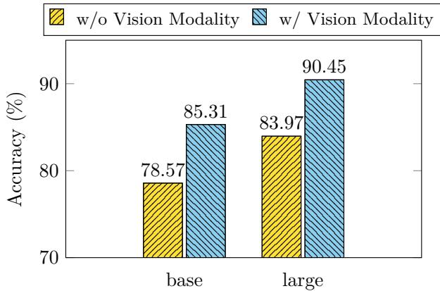

# Multimodal Chain-of-Thought Reasoning in Language Models

Zhuosheng Zhang∗   
School of Electronic Information and Electrical Engineering,   
Shanghai Jiao Tong University

zhangzs@sjtu.edu.cn

Aston Zhang∗ GenAI, Meta

az@astonzhang.com

Mu Li Amazon Web Services

muli@cs.cmu.edu

Hai Zhao   
Department of Computer Science and Engineering,   
Shanghai Jiao Tong University

zhaohai@cs.sjtu.edu.cn

George Karypis Amazon Web Services

gkarypis@amazon.com

Alex Smola Amazon Web Services

alex@smola.org

Reviewed on OpenReview: https: // openreview. net/ forum? id= y1pPWFVfvR

# Abstract

Large language models (LLMs) have shown impressive performance on complex reasoning by leveraging chain-of-thought (CoT) prompting to generate intermediate reasoning chains as the rationale to infer the answer. However, existing CoT studies have primarily focused on the language modality. We propose Multimodal-CoT that incorporates language (text) and vision (images) modalities into a two-stage framework that separates rationale generation and answer inference. In this way, answer inference can leverage better generated rationales that are based on multimodal information. Experimental results on ScienceQA and A-OKVQA benchmark datasets show the effectiveness of our proposed approach. With MultimodalCoT, our model under 1 billion parameters achieves state-of-the-art performance on the ScienceQA benchmark. Our analysis indicates that Multimodal-CoT offers the advantages of mitigating hallucination and enhancing convergence speed. Code is publicly available at https://github.com/amazon-science/mm-cot.

# 1 Introduction

Imagine reading a textbook with no figures or tables. Our ability to knowledge acquisition is greatly strengthened by jointly modeling diverse data modalities, such as vision, language, and audio. Recently, large language models (LLMs) (Brown et al., 2020; Thoppilan et al., 2022; Rae et al., 2021; Chowdhery et al., 2022) have shown impressive performance in complex reasoning by generating intermediate reasoning steps before inferring the answer. The intriguing technique is called chain-of-thought (CoT) reasoning (Wei et al., 2022b; Kojima et al., 2022; Zhang et al., 2023d).

However, existing studies related to CoT reasoning are largely isolated in the language modality (Wang et al., 2022c; Zhou et al., 2022; Lu et al., 2022b; Fu et al., 2022), with little consideration of multimodal scenarios. To elicit CoT reasoning in multimodality, we advocate a Multimodal-CoT paradigm. Given the inputs in different modalities, Multimodal-CoT decomposes multi-step problems into intermediate reasoning steps (rationale) and then infers the answer. Since vision and language are the most popular modalities, we focus on those two modalities in this work. An example is shown in Figure 1.

  
Figure 1: Example of the multimodal CoT task.

In general, Multimodal-CoT reasoning can be elicited through two primary paradigms: (i) prompting LLMs and (ii) fine-tuning smaller models.1 We will delve into these paradigms and delineate their associated challenges as follows.

The most immediate way to perform Multimodal-CoT is to transform the input of different modalities into a unified modality and prompt LLMs to perform CoT (Zhang et al., 2023a; Lu et al., 2023; Liu et al., 2023; Alayrac et al., 2022; Hao et al., 2022; Yasunaga et al., 2022). For example, it is possible to generate a caption for an image by a captioning model and then concatenate the caption with the original language input to be fed into LLMs (Lu et al., 2022a). The development of large multimodal models such as GPT-4V (OpenAI, 2023) and Gemini (Reid et al., 2024) has notably enhanced the quality of generated captions, resulting in finer-grained and more detailed descriptions. However, the captioning process still incurs significant information loss when transforming vision signals into textual descriptions. Consequently, using image captions rather than vision features may suffer from a lack of mutual synergy in the representation space of different modalities. In addition, LLMs either have paywalls or resource-consuming to deploy locally.

To facilitate the interaction between modalities, another potential solution is to fine-tune smaller language models (LMs) by fusing multimodal features (Zhang et al., 2023c; Zhao et al., 2023). As this approach allows the flexibility of adjusting model architectures to incorporate multimodal features, we study fine-tuning models in this work instead of prompting LLMs. The key challenge is that language models under 100 billion parameters tend to generate hallucinated rationales that mislead the answer inference (Ho et al., 2022; Magister et al., 2022; Ji et al., 2022; Zhang et al., 2023b).

To mitigate the challenge of hallucination, we propose Multimodal-CoT that incorporates language (text) and vision (images) modalities into a two-stage framework that separates rationale generation and answer inference.2 In this way, answer inference can leverage better generated rationales that are based on multimodal information. Our experiments were conducted on the ScienceQA (Lu et al., 2022a) and A-OKVQA (Schwenk et al., 2022) datasets, which are the latest multimodal reasoning benchmarks with annotated reasoning chains.

Our method achieves state-of-the-art performance on the ScienceQA benchmark upon the release. We find that Multimodal-CoT is beneficial in mitigating hallucination and boosting convergence. Our contributions are summarized as follows:

(i) To the best of our knowledge, this work is the first to study CoT reasoning in different modalities in scientific peer-reviewed literature.   
(ii) We propose a two-stage framework by fine-tuning language models to fuse vision and language representations to perform Multimodal-CoT. The model is able to generate informative rationales to facilitate inferring final answers.   
(iii) We elicit the analysis of why the naive way of employing CoT fails in the context and how incorporating vision features alleviates the problem. The approach has been shown to be generally effective across tasks and backbone models.

Table 1: Representative CoT techniques (FT: fine-tuning; KD: knowledge distillation). Segment 1: in-context learning techniques; Segment 2: fine-tuning techniques. To the best of our knowledge, our work is the first to study CoT reasoning in different modalities in scientific peer-reviewed literature. Besides, we focus on 1B-models, without relying on the outputs of LLMs.   

<table><tr><td>Models</td><td>Mutimodal Model / Engine Training CoT Role</td><td></td><td></td><td></td><td>CoT Source</td></tr><tr><td>Zero-Shot-CoT (Kojima et al., 2022)</td><td>X</td><td>GPT-3.5 (175B)</td><td>ICL</td><td>Reasoning</td><td>Template</td></tr><tr><td>Few-Shot-CoT (Wei et al., 2022b)</td><td></td><td>PaLM (540B)</td><td>ICL</td><td>Reasoning</td><td>Hand-crafted</td></tr><tr><td>Self-Consistency-CoT (Wang et al., 2022b)</td><td>××</td><td>Codex (175B)</td><td>ICL</td><td>Reasoning</td><td>Hand-crafted</td></tr><tr><td>Least-to-Most Prompting (Zhou et al., 2022)</td><td>X</td><td>Codex (175B)</td><td>ICL</td><td>Reasoning</td><td>Hand-crafted</td></tr><tr><td>Retrieval-CoT (Zhang et al., 2023d)</td><td>X</td><td>GPT-3.5 (175B)</td><td>ICL</td><td>Reasoning</td><td>Auto-generated</td></tr><tr><td>PromptPG-CoT (Lu et al., 2022b)</td><td>X</td><td>GPT-3.5 (175B)</td><td>ICL</td><td>Reasoning</td><td>Hand-crafted</td></tr><tr><td>Auto-CoT (Zhang et al., 2023d)</td><td>X</td><td>Codex (175B)</td><td>ICL</td><td>Reasoning</td><td>Auto-generated</td></tr><tr><td>Complexity-CoT (Fu et al., 2022)</td><td>X</td><td>GPT-3.5 (175B)</td><td>ICL</td><td>Reasoning</td><td>Hand-crafted</td></tr><tr><td>Few-Shot-PoT (Chen et al., 2022)</td><td></td><td>GPT-3.5 (175B)</td><td>ICL</td><td>Reasoning</td><td>Hand-crafted</td></tr><tr><td>UnifiedQA (Lu et al., 2022a)</td><td>X</td><td>T5 (770M)</td><td>FT</td><td>Explanation</td><td>Crawled</td></tr><tr><td>Fine-Tuned T5 XXL (Magister et al., 2022)</td><td>X</td><td>T5 (11B)d)</td><td>KD</td><td>Reasoning</td><td>LLM-generated</td></tr><tr><td>Fine-Tune-CoT (Ho et al., 2022)</td><td>X</td><td>GPT-3 (6.7B)</td><td>KD</td><td>Reasoning</td><td>LLM-generated</td></tr><tr><td>Multimodal-CoT (our work)</td><td>√</td><td>T5 (770M)</td><td>FT</td><td>Reasoning</td><td>Crawled</td></tr></table>

# 2 Background

This section reviews studies eliciting CoT reasoning by prompting and fine-tuning language models.

# 2.1 CoT Reasoning with LLMs

Recently, CoT has been widely used to elicit the multi-step reasoning abilities of LLMs (Wei et al., 2022b). Concretely, CoT techniques encourage the LLM to generate intermediate reasoning chains for solving a problem. Studies have shown that LLMs can perform CoT reasoning with two major paradigms of techniques: Zero-Shot-CoT (Kojima et al., 2022) and Few-Shot-CoT (Wei et al., 2022b; Zhang et al., 2023d). For Zero-Shot-CoT, Kojima et al. (2022) showed that LLMs are decent zero-shot reasoners by adding a prompt like “Let’s think step by step” after the test question to invoke CoT reasoning. For Few-Shot-CoT, a few step-by-step reasoning demonstrations are used as conditions for inference. Each demonstration has a question and a reasoning chain that leads to the final answer. The demonstrations are commonly obtained by hand-crafting or automatic generation. These two techniques, hand-crafting and automatic generation are thus referred to as Manual-CoT (Wei et al., 2022b) and Auto-CoT (Zhang et al., 2023d).

With effective demonstrations, Few-Shot-CoT often achieves stronger performance than Zero-Shot-CoT and has attracted more research interest. Therefore, most recent studies focused on how to improve Few-Shot-CoT. Those studies are categorized into two major research lines: (i) optimizing the demonstrations; (ii) optimizing the reasoning chains. Table 1 compares typical CoT techniques.

Optimizing Demonstrations The performance of Few-Shot-CoT relies on the quality of demonstrations. As reported in Wei et al. (2022b), using demonstrations written by different annotators results in dramatic accuracy disparity in reasoning tasks. Beyond hand-crafting the demonstrations, recent studies have investigated ways to optimize the demonstration selection process. Notably, Rubin et al. (2022) retrieved the semantically similar demonstrations with the test instance. However, this approach shows a degraded performance when there are mistakes in the reasoning chains (Zhang et al., 2023d). To address the limitation, Zhang et al. (2023d) found that the key is the diversity of demonstration questions and proposed Auto-CoT: (i) partition questions of a given dataset into a few clusters; (ii) sample a representative question from each cluster and generate its reasoning chain using Zero-Shot-CoT with simple heuristics. In addition, reinforcement learning (RL) and complexity-based selection strategies were proposed to obtain effective demonstrations. Fu et al. (2022) chose examples with complex reasoning chains (i.e., with more reasoning steps) as the demonstrations. Lu et al. (2022b) trained an agent to find optimal in-context examples from a candidate pool and maximize the prediction rewards on given training examples when interacting with GPT-3.5.

Optimizing Reasoning Chains A notable way to optimize reasoning chains is problem decomposition. Zhou et al. (2022) proposed least-to-most prompting to decompose complex problems into sub-problems and then solve these sub-problems sequentially. As a result, solving a given sub-problem is facilitated by the answers to previously solved sub-problems. Similarly, Khot et al. (2022) used diverse decomposition structures and designed different prompts to answer each sub-question. In addition to prompting the reasoning chains as natural language texts, Chen et al. (2022) proposed program-of-thoughts (PoT), which modeled the reasoning process as a program and prompted LLMs to derive the answer by executing the generated programs. Another trend is to vote over multiple reasoning paths for a test question. Wang et al. (2022b) introduced a self-consistency decoding strategy to sample multiple outputs of LLMs and then took a majority over the final answers. Wang et al. (2022c) and Li et al. (2022c) introduced randomness in the input space to produce more diverse outputs for voting.

# 2.2 Eliciting CoT Reasoning by Fine-Tuning Models

A recent interest is eliciting CoT reasoning by fine-tuning language models. Lu et al. (2022a) fine-tuned the encoder-decoder T5 model on a large-scale dataset with CoT annotations. However, a dramatic performance decline is observed when using CoT to infer the answer, i.e., generating the reasoning chain before the answer (reasoning). Instead, CoT is only used as an explanation after the answer. Magister et al. (2022) and Ho et al. (2022) employed knowledge distillation by fine-tuning a student model on the chain-of-thought outputs generated by a larger teacher model. Wang et al. (2022a) proposed an iterative context-aware prompting approach to dynamically synthesize prompts conditioned on the current step’s contexts.

There is a key challenge in training 1B-models to be CoT reasoners. As observed by Wei et al. (2022b), models under 100 billion parameters tend to produce illogical CoT that leads to wrong answers. In other words, it might be harder for 1B-models to generate effective CoT than directly generating the answer. It becomes even more challenging in a multimodal setting where answering the question also requires understanding the multimodal inputs. In the following part, we will explore the challenge of Multimodal-CoT and investigate how to perform effective multi-step reasoning.

# 3 Challenge of Multimodal-CoT

Existing studies have suggested that the CoT reasoning ability may emerge in language models at a certain scale, e.g., over 100 billion parameters (Wei et al., 2022a). However, it remains an unresolved challenge to elicit such reasoning abilities in 1B-models, let alone in the multimodal scenario. This work focuses on 1B-models as they can be fine-tuned and deployed with consumer-grade GPUs (e.g., 32G memory). In this section, we will investigate why 1B-models fail at CoT reasoning and study how to design an effective approach to overcome the challenge.

# 3.1 Towards the Role of CoT

To begin with, we fine-tune a text-only baseline for CoT reasoning on the ScienceQA benchmark (Lu et al., 2022a). We adopt FLAN-AlpacaBase as the backbone language model.3 Our task is modeled as a text generation problem, where the model takes the textual information as the input and generates the output sequence that consists of the rationale and the answer.

As an example shown in Figure 1, the model takes the concatenation of tokens of the question text (Q), the context text (C), and multiple options (M) as the input. To study the effect of CoT, we compare the performance with three variants: (i) No-CoT which predicts the answer directly (QCM ${  } \mathrm { A }$ ); (ii) Reasoning where answer inference is conditioned to the rationale (QCM

Table 2: Effects of CoT in the one-stage setting.   

<table><tr><td>Method</td><td>Format</td><td>Accuracy</td></tr><tr><td>No-CoT</td><td>QCM→A</td><td>81.63</td></tr><tr><td>Reasoning</td><td>QCM→RA</td><td>69.32</td></tr><tr><td>Explanation</td><td>QCM→AR</td><td>69.68</td></tr></table>

RA); (iii) Explanation where the rationale is used for explaining the answer inference (QCM AR).

# Problem

Question: Will these magnets attract or repel each other?   
Context: Two magnets are placed as shown. Hint: Magnets that attract pull together. Magnets that repel push apart.

Options: (A) attract

(B) repel

Gold Rationale: Will these magnets attract or repel? To find out, look at which poles are closest to each other. The north pole of one magnet is closest to the south pole of the other magnet. Poles that are different attract. So, these magnets will attract each other. Answer: The answer is (A).

# Baseline

# $^ +$ Vision Features

Generated Rationale: Will these magnets attract or repel? To find out, look at which poles are closest to each other. The south pole of one magnet is closest to the south pole of the other magnet. Poles that are the same repel. So, these magnets will repel each other.

Answer: The answer is (B).

Generated Rationale: Will these magnets attract or repel? To find out, look at which poles are closest to each other. The north pole of one magnet is closest to the south pole of the other magnet. Poles that are different attract. So, these magnets will attract each other.

Answer: The answer is (A).

Figure 2: Example of the two-stage framework without vision features (baseline) and with vision features (ours) for generating rationales and predicting answers. The upper part presents the problem details with a gold rationale, and the lower part shows the outputs of the baseline and our method incorporated with vision features. We observe that the baseline fails to predict the right answer due to the misleading by hallucinated rationales. More examples are shown in Appendix A.1.

Surprisingly, as shown in Table 2, we observe a $\downarrow 1 2 . 3 1 \%$ accuracy decrease (81.63%→69.32 $\%$ ) if the model predicts rationales before answers (QCM RA). The results imply that the rationales might not necessarily contribute to predicting the right answer. According to Lu et al. (2022a), the plausible reason might be that the model exceeds the maximum token limits before obtaining the required answer or stops generating the prediction early. However, we find that the maximum length of the generated outputs (RA) is always less than 400 tokens, which is below the length limit of language models (i.e., 512 in T5 models). Therefore, it deserves a more in-depth investigation into why the rationales harm answer inference.

# 3.2 Misleading by Hallucinated Rationales

To dive into how the rationales affect the answer prediction, we separate the CoT problem into two stages, rationale generation and answer inference.4 We report the RougeL score and accuracy for the rationale generation and answer inference, respectively. Table 3 shows the results based on the two-stage framework. Although the two-stage baseline model achieves a 90.73 RougeL score of the rationale generation, the answer

Table 3: Two-stage setting of (i) rationale generation (RougeL) and (ii) answer inference (Accuracy).   

<table><tr><td>Method</td><td colspan="2">(i) QCM→ R (i) QCMR→ A</td></tr><tr><td>Two-Stage Framework</td><td>90.73</td><td>78.57</td></tr><tr><td>w/ Captions</td><td>90.88</td><td>79.37</td></tr><tr><td>w/ Vision Features</td><td>93.46</td><td>85.31</td></tr></table>

inference accuracy is only $7 8 . 5 7 \%$ . Compared with the QCM→A variant $( 8 1 . 6 3 \%$ ) in Table 2, the result shows that the generated rationale in the two-stage framework does not improve answer accuracy.

Then, we randomly sample 50 error cases and find that the model tends to generate hallucinated rationales that mislead the answer inference. As an example shown in Figure 2, the model (left part) hallucinates that, “The south pole of one magnet is closest to the south pole of the other magnet”, due to the lack of reference to the vision content. We find that such mistakes occur at a ratio of $5 6 \%$ among the error cases (Figure 3(a)).

# 3.3 Multimodality Contributes to Effective Rationales

We speculate that such a phenomenon of hallucination is due to a lack of necessary vision contexts for performing effective Multimodal-CoT. To inject vision information, a simple way is to transform the image into a caption (Lu et al., 2022a) and then append the caption in the input of both stages.

However, as shown in Table 3, using captions only yields marginal performance gains (↑0.80%). Then, we explore an advanced technique by incorporating vision features into the language model. Concretely, we feed the image to the ViT model (Dosovitskiy et al., 2021b) to extract vision features. Then we fuse the vision features with the encoded language representations before feeding the decoder (more details will be presented in Section 4). Interestingly, with vision features, the RougeL score of the rationale generation has boosted to $9 3 . 4 6 \%$ (QCM R), which correspondingly contributes to better answer accuracy of 85.31% (QCMR A).

  
Figure 3: The ratio of (a) hallucination mistakes and (b) correction rate w/ vision features.

With those effective rationales, the phenomenon of hallucination is mitigated — $6 0 . 7 \%$ hallucination mistakes in Section 3.2 have been corrected (Figure 3(b)), as an example shown in Figure 2 (right part).5 The analysis so far compellingly shows that vision features are indeed beneficial for generating effective rationales and contributing to accurate answer inference. As the two-stage method achieves better performance than one-stage methods, we choose the two-stage method in our Multimodal-CoT framework.

# 4 Multimodal-CoT

In light of the discussions in Section 3, we propose Multimodal-CoT. The key motivation is the anticipation that the answer inference can leverage better generated rationales that are based on multimodal information. In this section, we will overview the procedure of the framework and elaborate on the technical design of the model architecture.

  
Figure 4: Overview of our Multimodal-CoT framework. Multimodal-CoT consists of two stages: (i) rationale generation and (ii) answer inference. Both stages share the same model structure but differ in the input and output. In the first stage, we feed the model with language and vision inputs to generate rationales. In the second stage, we append the original language input with the rationale generated from the first stage. Then, we feed the updated language input with the original vision input to the model to infer the answer.

# 4.1 Framework Overview

Multimodal-CoT consists of two operation stages: (i) rationale generation and (ii) answer inference. Both stages share the same model structure but differ in the input $X$ and output $Y$ . The overall procedure is illustrated in Figure 4. We will take vision-language as an example to show how Multimodal-CoT works.

In the rationale generation stage, we feed the model with $X = \{ X _ { \mathrm { l a n g u a g e } } ^ { 1 } , X _ { \mathrm { v i s i o n } } \}$ where $X _ { \mathrm { l a n g u a g e } } ^ { \mathrm { 1 } }$ represents the language input in the first stage and $X _ { \mathrm { v i s i o n } }$ represents the vision input, i.e., the image. For example, $X$ can be instantiated as a concatenation of question, context, and options of a multiple choice reasoning problem (Lu et al., 2022a) as shown in Figure 4. The goal is to learn a rationale generation model $R = F ( X )$ where $R$ is the rationale.

In the answer inference stage, the rationathe language input in the second stage, $R$ iginal la where guage input denotes con $X _ { \mathrm { l a n g u a g e } } ^ { 1 }$ to constructn. Then, we pdated input . $X ^ { \prime } = \{ X _ { \mathrm { l a n g u a g e } } ^ { \mathrm { 2 } } , X _ { \mathrm { v i s i o n } } \}$ $X _ { \mathrm { l a n g u a g e } } ^ { \mathrm { 2 } } = X _ { \mathrm { l a n g u a g e } } ^ { \mathrm { 1 } } \circ R$ to the answer inference model to infer the final answer $A = F ( X ^ { \prime } )$

In both stages, we train two models with the same architecture independently. They take the annotated elements (e.g., $X  R$ , $X R  A$ , respectively) from the training set for supervised learning. During inference, given $X$ , the rationales for the test sets are generated using the model trained in the first stage; they are used in the second stage for answer inference.

# 4.2 Model Architecture

Given language input of generating target t $X _ { \mathrm { l a n g u a g e } } \in \{ X _ { \mathrm { l a n g u a g e } } ^ { 1 } , X _ { \mathrm { l a n g u a g e } } ^ { 2 } \}$ and vision input  answer in Figure $X _ { \mathrm { v i s i o n } }$ , we cength pute the probabilityby $Y$ $N$

$$
p ( { \cal Y } | { \cal X } _ { \mathrm { l a n g u a g e } } , { \cal X } _ { \mathrm { v i s i o n } } ) = \prod _ { i = 1 } ^ { N } p _ { \theta } ( Y _ { i } \mid { \cal X } _ { \mathrm { l a n g u a g e } } , { \cal X } _ { \mathrm { v i s i o n } } , { \cal Y } _ { < i } ) ,
$$

where $p _ { \theta } \left( Y _ { i } \mid X _ { \mathrm { l a n g u a g e } } , X _ { \mathrm { v i s i o n } } , Y _ { < i } \right)$ is implemented with a Transformer-based network (Vaswani et al., 2017). The network has three major procedures: encoding, interaction, and decoding. Specifically, we feed the language text into a Transformer encoder to obtain a textual representation, which is interacted and fused with the vision representation before being fed into the Transformer decoder.

Encoding The model $F ( X )$ takes both the language and vision inputs and obtains the text representation $H _ { \mathrm { l a n g u a g e } }$ and the image feature $H _ { \mathrm { v i s i o n } }$ by the following functions:

$$
\begin{array} { r l r } { H _ { \mathrm { l a n g u a g e } } } & { = } & { \mathrm { L a n g u a g e E n c o d e r } ( X _ { \mathrm { l a n g u a g e } } ) , } \\ { H _ { \mathrm { v i s i o n } } } & { = } & { W _ { h } \cdot \mathrm { V i s i o n E x t r a c t o r } ( X _ { \mathrm { v i s i o n } } ) , } \end{array}
$$

where LanguageEncoder $( \cdot )$ is implemented as a Transformer model. We use the hidden states of the last layer in the Transformer encoder as the language representation $H _ { \mathrm { l a n g u a g e } } \in \mathbb { R } ^ { n \times d }$ where $n$ denotes the length of the language input, and $d$ is the hidden dimension. Meanwhile, VisionExtractor $( \cdot )$ is used to vectorize the input image into vision features. Inspired by the recent success of Vision Transformers (Dosovitskiy et al., 2021a), we fetch the patch-level features by frozen vision extraction models, such as ViT (Dosovitskiy et al., 2021b). After obtaining the patch-level vision features, we apply a learnable projection matrix $W _ { h }$ to convert the shape of VisionExtractor( $X _ { \mathrm { v i s i o n . } }$ ) into that of $H _ { \mathrm { l a n g u a g e } }$ ; thus we have $H _ { \mathrm { v i s i o n } } \in \mathbb { R } ^ { m \times d }$ where $m$ is the number of patches.

Note that our approach is general to both scenarios with or without image context. For the questions without associated images, we use all-zero vectors as the “blank features” with the same shape as the normal image features to tell the model to ignore them.

Interaction After obtaining language and vision representations, we use a single-head attention network to correlate text tokens with image patches, where the query ( $Q$ ), key ( $K$ ) and value ( $V$ ) are $H _ { \mathrm { l a n g u a g e } }$ , $H _ { \mathrm { v i s i o n } }$ and $H _ { \mathrm { v i s i o n } }$ , respectively. The attention output $H _ { \mathrm { v i s i o n } } ^ { \mathrm { a t t n } } \in \mathbb { R } ^ { n \times d }$ is defined as: $\begin{array} { r } { H _ { \mathrm { v i s i o n } } ^ { \mathrm { a t t n } } = \mathrm { S o f t m a x } ( \frac { Q K ^ { \top } } { \sqrt { d _ { k } } } ) V } \end{array}$ where $d _ { k }$ is the same as the dimension of $H _ { \mathrm { l a n g u a g e } }$ because a single head is used.

Then, we apply the gated fusion mechanism (Zhang et al., 2020; Wu et al., 2021; Li et al., 2022a) to fuse $H _ { \mathrm { l a n g u a g e } }$ and $H _ { \mathrm { v i s i o n } }$ . The fused output $H _ { \mathrm { f u s e } } \in \mathbb { R } ^ { n \times d }$ is obtained by:

$$
\begin{array} { r c l } { { \lambda } } & { { = } } & { { \mathrm { S i g m o i d } ( W _ { l } H _ { \mathrm { l a n g u a g e } } + W _ { v } H _ { \mathrm { v i s i o n } } ^ { \mathrm { a t t n } } ) , } } \\ { { { \cal H } _ { \mathrm { f u s e } } } } & { { = } } & { { ( 1 - \lambda ) \cdot { \cal H } _ { \mathrm { l a n g u a g e } } + \lambda \cdot { \cal H } _ { \mathrm { v i s i o n } } ^ { \mathrm { a t t n } } , } } \end{array}
$$

where $W _ { l }$ and $W _ { v }$ are learnable parameters.

Decoding Finally, the fused output $H _ { \mathrm { f u s e } }$ is fed into the Transformer decoder to predict the target $Y$ .

# 5 Experiments

This section will present the benchmark dataset, the implementation of our technique, and the baselines for comparisons. Then, we will report our main results and findings.

# 5.1 Dataset

Our method is evaluated on the ScienceQA (Lu et al., 2022a) and A-OKVQA (Schwenk et al., 2022) benchmark datasets. We choose those datasets because they are latest multimodal reasoning benchmarks with annotated reasoning chains. ScienceQA is a large-scale multimoda science question dataset with annotated lectures and explanations. It contains $2 1 k$ multimodal multiple choice questions with rich domain diversity across 3 subjects, 26 topics, 127 categories, and 379 skills. There are $1 2 k$ , $4 k$ , and $4 k$ questions in the training, validation, and test splits, respectively. A-OKVQA is a knowledge-based visual question answering benchmark, which has $2 5 k$ questions requiring a broad base of commonsense and world knowledge to answer. It has $1 7 k / 1 k / 6 k$ questions for train/val/test. As A-OKVQA provides multiple-choice and direct answer evaluation settings, we use the multiple-choice setting to keep consistency with ScienceQA.

# 5.2 Implementation

The following part presents the experimental settings of Multimodal-CoT and the baseline methods.

Experimental Settings We adopt the T5 encoder-decoder architecture (Raffel et al., 2020) under Base (200M) and large (700M) settings in our framework. We apply FLAN-Alpaca to initialize our model weights.6 We will show that Multimodal-CoT is generally effective with other backbone LMs, such as UnifiedQA (Khashabi et al., 2020) and FLAN-T5 (Chung et al., 2022) (Section 6.3). The vision features are obtained by the frozen ViT-large encoder (Dosovitskiy et al., 2021b). We fine-tune the models up to 20 epochs, with a learning rate of 5e-5. The maximum input sequence length is 512. The batch size is 8. Our experiments are run on 8 NVIDIA Tesla V100 32G GPUs. More details are presented in Appendix B.

Baseline Models We utilized three categories of methods as our baselines:

(i) Visual question answering (VQA) models, including MCAN (Yu et al., 2019), Top-Down (Anderson et al., 2018), BAN (Kim et al., 2018), DFAF (Gao et al., 2019), ViLT (Kim et al., 2021), Patch-TRM (Lu et al., 2021), and VisualBERT (Li et al., 2019). These VQA baselines take the question, context, and choices as textual input, while utilizing the image as visual input. They employ a linear classifier to predict the score distribution over the choice candidates.

(ii) LMs, including the text-to-text UnifiedQA model (Khashabi et al., 2020) and few-shot learning LLMs (GPT-3.5, ChatGPT, GPT-4, and Chameleon (Lu et al., 2023)). UnifiedQA (Khashabi et al., 2020) is adopted as it is the best fine-tuning model in Lu et al. (2022a). UnifiedQA takes the textual information as the input and outputs the answer choice. The image is converted into a caption extracted by an image captioning model following Lu et al. (2022a). UnifiedQA treats our task as a text generation problem. In Lu et al. (2022a), it is trained to generate a target answer text, i.e., one of the candidate options. Then, the most similar option is selected as the final prediction to evaluate the question answering accuracy. For GPT-3.5 models (Chen et al., 2020), we use the text-davinci-002 and text-davinci-003 engines due to their strong performance. In addition, we also include the comparison with ChatGPT and GPT-4. The inference is based on the few-shot prompting, where two in-context examples from the training set are concatenated before the test instance. The few-shot demonstrations are the same as those in Lu et al. (2022a).

(iii) Fine-tuned large vision-language model. We select the recently released LLaMA-Adapter (Zhang et al. 2023a), LLaVA (Liu et al., 2023), and InstructBLIP (Dai et al., 2023) as the competitive large vision-language baselines. For LLaMA-Adapter, the backbone model is the 7B LLaMA model fine-tuned with $5 2 k$ self-instruct demonstrations. To adapt to our tasks, the model is further fine-tuned on the ScienceQA dataset.

Table 4: Main results ( $\%$ ). Size $-$ backbone model size from the ScienceQA leaderboard (“-” means unavailable or unknown). Question classes: NAT $-$ natural science, SOC = social science, LAN = language science, TXT = text context, IMG = image context, NO = no context, G1- $6 =$ grades 1-6, G7-12 = grades 7-12. Segment 1: Human performance; Segment 2: VQA baselines; Segment 3: LM baselines, i.e., UnifiedQA and few-shot learning LLMs; Segment 4: Fine-tuned large vision-language models; Segment 5: Our Multimodal-CoT results. Prior published best results are marked with an underline. Our best average result is in bold face. † denotes concurrent studies, either through citation or comparison with Multimodal-CoT.   

<table><tr><td>Model</td><td>Size</td><td>NAT</td><td>SOC</td><td>LAN</td><td>TXT</td><td>IMG</td><td>NO</td><td>G1-6</td><td>G7-12</td><td>Avg</td></tr><tr><td>Human</td><td></td><td>90.23</td><td>84.97</td><td>87.48</td><td>89.60</td><td>87.50</td><td>88.10</td><td>91.59</td><td>82.42</td><td>88.40</td></tr><tr><td>MCAN (Yu et al., 2019)</td><td>95M</td><td>56.08</td><td>46.23</td><td>58.09</td><td>59.43</td><td>51.17</td><td>55.40</td><td>51.65</td><td>59.72</td><td>54.54</td></tr><tr><td>Top-Down (Anderson et al., 2018)</td><td>70M</td><td>59.50</td><td>54.33</td><td>61.82</td><td>62.90</td><td>54.88</td><td>59.79</td><td>57.27</td><td>62.16</td><td>59.02</td></tr><tr><td>BAN (Kim et al., 2018)</td><td>112M</td><td>60.88</td><td>46.57</td><td>66.64</td><td>62.61</td><td>52.60</td><td>65.51</td><td>56.83</td><td>63.94</td><td>59.37</td></tr><tr><td>DFAF (Gao et al., 2019)</td><td>74M</td><td>64.03</td><td>48.82</td><td>63.55</td><td>65.88</td><td>54.49</td><td>64.11</td><td>57.12</td><td>67.17</td><td>60.72</td></tr><tr><td>ViLT (Kim et al., 2021)cid</td><td>113M</td><td>60.48</td><td>63.89</td><td>60.27</td><td>63.20</td><td>61.38</td><td>57.00</td><td>60.72</td><td>61.90</td><td>61.14</td></tr><tr><td>Patch-TRM (Lu et al., 2021)</td><td>90M</td><td>65.19</td><td>46.79</td><td>65.55</td><td>66.96</td><td>55.28</td><td>64.95</td><td>58.04</td><td>67.50</td><td>61.42</td></tr><tr><td>VisualBERT (Li et al., 2019)</td><td>111M</td><td>59.33</td><td>69.18</td><td>61.18</td><td>62.71</td><td>62.17</td><td>58.54</td><td>62.96</td><td>59.92</td><td>61.87</td></tr><tr><td>Unif edQA (Lu et al., 2022a)</td><td>223M</td><td>71.00</td><td>76.04</td><td>78.91</td><td>66.42</td><td>66.53</td><td>81.81</td><td>77.06</td><td>68.82</td><td>74.11</td></tr><tr><td>GPT-3.5 (text-davinci-002) (Lu et al., 2022a)</td><td>173B</td><td>75.44</td><td>70.87</td><td>78.09</td><td>74.68</td><td>67.43</td><td>79.93</td><td>78.23</td><td>69.68</td><td>75.17</td></tr><tr><td>GPT-3.5 (text-davinci-003)</td><td>173B</td><td>77.71</td><td>68.73</td><td>80.18</td><td>75.12</td><td>67.92</td><td>81.81</td><td>80.58</td><td>69.08</td><td>76.47</td></tr><tr><td>ChatGPT (Lu et al., 2023)</td><td></td><td>78.82</td><td>70.98</td><td>83.18</td><td>77.37</td><td>67.92</td><td>86.13</td><td>80.72</td><td>74.03</td><td>78.31</td></tr><tr><td>GPT-4 (Lu et al., 2023)</td><td></td><td>85.48</td><td>72.44</td><td>90.27</td><td>82.65</td><td>71.49</td><td>92.89</td><td>86.66</td><td>79.04</td><td>83.99</td></tr><tr><td>Chameleon (ChatGPT) (Lu et al., 2023)†</td><td></td><td>81.62</td><td>70.64</td><td>84.00</td><td>79.77</td><td>70.80</td><td>86.62</td><td>81.86</td><td>76.53</td><td>79.93</td></tr><tr><td>Chameleon (GPT-4) (Lu et al., 2023)†</td><td></td><td>89.83</td><td>74.13</td><td>89.82</td><td>88.27</td><td>77.64</td><td>92.13</td><td>88.03</td><td>83.72</td><td>86.54</td></tr><tr><td>LLaMA-Adapter (Zhang et al., 2023a)†</td><td>6B</td><td>84.37</td><td>88.30</td><td>84.36</td><td>83.72</td><td>80.32</td><td>86.90</td><td>85.83</td><td>84.05</td><td>85.19</td></tr><tr><td>LLaVA (Liu et al., 2023)†t</td><td>13B</td><td>90.36</td><td>95.95</td><td>88.00</td><td>89.49</td><td>88.00</td><td>90.66</td><td>90.93</td><td>90.90</td><td>90.92</td></tr><tr><td>InstructBLIP (Dai et al., 2023)†</td><td>11B</td><td>-</td><td>-</td><td>-</td><td>-</td><td>90.70</td><td>-</td><td>-</td><td>-</td><td></td></tr><tr><td>Mutimodal-CoTBase</td><td>223M</td><td>84.06</td><td>92.35</td><td>82.18</td><td>82.75</td><td>82.75</td><td>84.74</td><td>85.79</td><td>84.44</td><td>85.31</td></tr><tr><td>Mutimodal-CoTLarge</td><td>738M</td><td>91.03</td><td>93.70</td><td>86.64</td><td>90.13</td><td>88.25</td><td>89.48</td><td>91.12</td><td>89.26</td><td>90.45</td></tr></table>

# 5.3 Main Results

Table 4 shows the main results in the ScienceQA benchmark. We observe that Mutimodal-CoTLarge achieves substantial performance gains over the prior best model in publications $8 6 . 5 4 \%  9 0 . 4 5 \%$ ). The efficacy of Multimodal-CoT is further supported by the results obtained from the A-OKVQA benchmark in Table 5.

It is worth noting that Chameleon, LLaMA-Adapter, LLaVA, and InstructBLIP are concurrent works released several months after our work. In the subsequent Section 6.2, we will show that our method is orthogonal to those multimodal models (e.g., InstructBLIP) and can be potentially used with them together to improve generality further, i.e., scaled to scenarios where human-annotated rationales are unavailable, thereby establishing the effectiveness across diverse tasks.

Ablation study results in Table 6 show that both the

Table 5: Results on A-OKVQA. Baseline results are from (Chen et al., 2023) and Schwenk et al. (2022).   

<table><tr><td>Model</td><td>Accuracy</td></tr><tr><td>BERT</td><td>32.93</td></tr><tr><td>GPT-3 (Curie)</td><td>35.07</td></tr><tr><td>IPVR (OPT-66B)</td><td>48.6</td></tr><tr><td>ViLBERT</td><td>49.1</td></tr><tr><td>Language-only Baseline</td><td>47.86</td></tr><tr><td>Multimodal-CoT Base</td><td>50.57</td></tr></table>

integration of vision features and the two-stage framework design contribute to the overall performance.

Furthermore, we find that Multimodal-CoT demonstrates the ability to mitigate hallucination (Section 3.3) and improve convergence (Section 6.1).

Table 6: Ablation results of Multimodal-CoT.   

<table><tr><td>Model</td><td>Base</td><td>Large</td></tr><tr><td>Multimodal-CoT</td><td>85.31</td><td>90.45</td></tr><tr><td>w/o Two-Stage Framework</td><td>82.62</td><td>84.56</td></tr><tr><td>w/o Vision Features</td><td>78.57</td><td>83.97</td></tr></table>

# 6 Analysis

The following analysis will first show that Multimodal-CoT helps enhance convergence speed and has the feasibility of adaptation to scenarios without human-annotated rationales. Then, we investigate the general effectiveness of Multimodal-CoT with different backbone models and vision features. We will also conduct an error analysis to explore the limitations to inspire future studies. We use models under the base size for analysis unless otherwise stated.

# 6.1 Multimodality Boosts Convergence

Figure 5 shows the validation accuracy curve of the baseline and Multimodal-CoT across different training epochs. “One-stage” is based on the QCM A input-output format as it achieves the best performance in Table 2 and “Two-stage” is our two-stage framework. We find that the twostage methods achieve relatively higher accuracy at the beginning than the one-stage baselines that generate the answer directly without CoT. However, without the vision features, the twostage baseline could not yield better results as the training goes on due to low-quality rationales (as observed in Section 3). In contrast, using vision features helps generate more effective rationales that contribute to better answer accuracy in our two-stage multimodal variant.

  
Figure 5: Accuracy curve of the No-CoT baseline and Multimodal-CoT variants.

# 6.2 When Multimodal-CoT Meets Large Models

A recent flame is to leverage large language models or large vision-language models to generate reasoning chains for multimodal question answering problems (Zhang et al., 2023a; Lu et al., 2023; Liu et al., 2023; Alayrac et al., 2022; Hao et al., 2022; Yasunaga et al., 2022). We are interested in whether we can use large models to generate the rationales for Multimodal-CoT; thus breaking the need for datasets with human-annotated rationales. During the first-stage training of Multimodal-CoT, our target rationales are based on human annotation in the benchmark datasets. Now, we replace the target rationales with those generated ones. As ScienceQA contains questions with images and without images, we leverage InstructBLIP and ChatGPT to generate the rationales for questions with paired images and questions without paired images, respectively.7 Then, we combine both of the generated pseudo-rationales as the target rationales for training (Multimodal-CoT w/ Generation) instead of relying on the human annotation of reasoning chains (Multimodal-CoT w/ Annotation).

Table 7 shows the comparison results. We see that using the generated rationales achieves comparable performance to using human-annotated rationales for training. In addition, the performance is also much better than directly prompting those baseline models to obtain the answer (in the QCM A inference format).

Table 7: Result comparison with large models. We also present the results of InstructBLIP and ChatGPT baselines for reference. The inference format for the two baselines is QCM A.   

<table><tr><td>Model</td><td>IMG</td><td>TXT</td><td>AVG</td></tr><tr><td>InstructBLIP ChatGPT</td><td>60.50</td><td>-</td><td>-</td></tr><tr><td></td><td>56.52</td><td>67.16</td><td>65.95</td></tr><tr><td>Multimodal-CoT w/ Annotation</td><td>88.25</td><td>90.13</td><td>90.45</td></tr><tr><td>Multimodal-CoT w/ Generation</td><td>83.54</td><td>85.73</td><td>87.76</td></tr></table>

We see that Multimodal-CoT can work effectively with large models. The findings above compellingly show the feasibility of adaptation to scenarios without human-annotated rationales, thereby establishing the effectiveness of our approach across diverse tasks.

# 6.3 Effectiveness Across Backbones

To test the generality of the benefits of our approach to other backbone models, we alter the underlying LMs to other variants in different types. As shown in Table 8, our approach is generally effective for the widely used backbone models.

Table 8: Using different backbone LMs.   

<table><tr><td colspan="2">Method Accuracy</td></tr><tr><td>Prior Best (Lu et al., 2022a)</td><td>75.17</td></tr><tr><td>MM-CoT on UnifiedQA</td><td>82.55</td></tr><tr><td>MM-CoT on FLAN-T5</td><td>83.19</td></tr><tr><td>MM-CoT on FLAN-Alpaca</td><td>85.31</td></tr></table>

Table 9: Using different vision features.   

<table><tr><td>Feature</td><td>Feature Shape</td><td>Accuracy</td></tr><tr><td>ViT</td><td>(145, 1024)</td><td>85.31</td></tr><tr><td>CLIP</td><td>(49, 2048))</td><td>84.27</td></tr><tr><td>DETR</td><td>(100, 256)</td><td>83.16</td></tr><tr><td>ResNet</td><td>(512, 2048)</td><td>82.86</td></tr></table>

# 6.4 Using Different Vision Features

Different vision features may affect the model performance. We compare three widely-used types of vision features, ViT (Dosovitskiy et al., 2021b), CLIP (Radford et al., 2021), DETR (Carion et al., 2020), and ResNet (He et al., 2016). ViT, CLIP, and DETR are patch-like features. For the ResNet features, we repeat the pooled features of ResNet-50 to the same length with the text sequence to imitate the patch-like features, where each patch is the same as the pooled image features. More details of the vision features are presented in Appendix B.1.

Table 9 shows the comparative results of vision features. We observe that ViT achieves relatively better performance. Therefore, we use ViT by default in Multimodal-CoT.

# 6.5 Alignment Strategies for Multimodal Interaction

We are interested in whether using different alignment strategies for multimodal interaction may contribute to different behaviors of multimodal-CoT. To this end, we tried another alignment strategy, i.e., image-grounded text encoder, in BLIP Li et al. (2022b). This alignment approach injects visual information by inserting one additional cross-attention layer between the self-attention layer and the feed-forward network for each transformer block of the text encoder. Our current strategy in the paper is similar to the unimodal encoder as in BLIP, which is used for comparison. In Table 10, we see that using other alignment strategies also contributes to better performance than direct answering.

Table 10: Result comparison with different alignment strategies for multimodal interaction.   

<table><tr><td>Model</td><td>Accuracy</td></tr><tr><td>Direct Answering</td><td>82.62</td></tr><tr><td>Unimodal encoder</td><td>85.31</td></tr><tr><td>Image-grounded text encoder</td><td>84.60</td></tr></table>

# 6.6 Generalization to Other Multimodal Reasoning Benchmarks

We are interested in evaluating the generalization capability of Multimodal-CoT to datasets outside its training domain. For this purpose, we utilize the widely-recognized multimodal reasoning benchmark, MMMU (Yue et al., 2024), and conduct an evaluation of Multimodal-CoT on MMMU without further training.

Table 11: Generalization performance on MMMU.   

<table><tr><td>Model</td><td>Size</td><td>Accuracy</td></tr><tr><td>Kosmos-2 (Peng et al., 2024)</td><td>1.6B</td><td>24.4</td></tr><tr><td>Fuyu (Bavishi et al., 2024)</td><td>8B</td><td>27.9</td></tr><tr><td>OpenFlamingo-2 (Awadalla et al., 2023)</td><td>9B</td><td>28.7</td></tr><tr><td>MiniGPT4-Vicuna (Zhu et al., 2023)</td><td>13B</td><td>26.8</td></tr><tr><td>Multimodal-CoT</td><td>738M</td><td>28.7</td></tr><tr><td>GPT-4V(ision) (OpenAI, 2023)</td><td>-</td><td>56.8</td></tr><tr><td>Gemini Ultra (Reid et al., 2024)</td><td>-</td><td>59.4</td></tr></table>

As shown in Table 11, it is evident that Multimodal-CoT demonstrates effective generalization to MMMU, achieving better performance than various larger models around 8B.

# 6.7 Error Analysis

To gain deeper insights into the behavior of Multimodal-CoT and facilitate future research, we manually analyzed randomly selected examples generated by our approach. The categorization results are illustrated in Figure 6. We examined 50 samples that yielded incorrect answers and categorized them accordingly. The examples from each category can be found in Appendix D.

The most prevalent error type is commonsense mistakes, accounting for $8 0 \%$ of the errors. These mistakes occur when the model is faced with questions that require commonsense knowledge, such as interpreting maps, counting objects in images, or utilizing the alphabet. The second error type is logical mistakes, constituting $1 4 \%$ of the errors, which involve contradictions in the reasoning process. Additionally, we have observed cases where incorrect answers are provided despite the CoT being either empty or correct, amounting to 6% of the errors. The CoT in these cases may not necessarily influence the final answer.

  
Figure 6: Categorization analysis.

The analysis reveals potential avenues for future research. Enhancements can be made to Multimodal-CoT by: (i) integrating more informative visual features and strengthening the interaction between language and vision to enable comprehension of maps and numerical counting; (ii) incorporating commonsense knowledge; and (iii) implementing a filtering mechanism, such as using only relevant CoTs to infer answers and disregarding irrelevant ones.

# 7 Conclusion

This paper formally studies the problem of multimodal CoT. We propose Multimodal-CoT that incorporates language and vision modalities into a two-stage framework that separates rationale generation and answer inference, so answer inference can leverage better generated rationales from multimodal information. With Multimodal-CoT, our model under 1 billion parameters achieves state-of-the-art performance on the ScienceQA benchmark. Analysis shows that Multimodal-CoT has the merits of mitigating hallucination and enhancing convergence speed. Our error analysis identifies the potential to leverage more effective vision features, inject commonsense knowledge, and apply filtering mechanisms to improve CoT reasoning in future studies.

# References

Jean-Baptiste Alayrac, Jeff Donahue, Pauline Luc, Antoine Miech, Iain Barr, Yana Hasson, Karel Lenc, Arthur Mensch, Katherine Millican, Malcolm Reynolds, et al. Flamingo: a visual language model for few-shot learning. Advances in Neural Information Processing Systems, 35:23716–23736, 2022.   
Peter Anderson, Xiaodong He, Chris Buehler, Damien Teney, Mark Johnson, Stephen Gould, and Lei Zhang. Bottom-up and top-down attention for image captioning and visual question answering. In 2018 IEEE Conference on Computer Vision and Pattern Recognition, CVPR 2018, Salt Lake City, UT, USA, June 18-22, 2018, pp. 6077–6086. IEEE Computer Society, 2018. doi: 10.1109/CVPR.2018.00636.   
Anas Awadalla, Irena Gao, Josh Gardner, Jack Hessel, Yusuf Hanafy, Wanrong Zhu, Kalyani Marathe, Yonatan Bitton, Samir Gadre, Shiori Sagawa, et al. Openflamingo: An open-source framework for training large autoregressive vision-language models. arXiv preprint arXiv:2308.01390, 2023.   
Rohan Bavishi, Erich Elsen, Curtis Hawthorne, Maxwell Nye, Augustus Odena, Arushi Somani, and Sağnak Taşırlar. Fuyu-8b: A multimodal architecture for ai agents, 2024.   
Tom B. Brown, Benjamin Mann, Nick Ryder, Melanie Subbiah, Jared Kaplan, Prafulla Dhariwal, Arvind Neelakantan, Pranav Shyam, Girish Sastry, Amanda Askell, Sandhini Agarwal, Ariel Herbert-Voss, Gretchen Krueger, Tom Henighan, Rewon Child, Aditya Ramesh, Daniel M. Ziegler, Jeffrey Wu, Clemens Winter, Christopher Hesse, Mark Chen, Eric Sigler, Mateusz Litwin, Scott Gray, Benjamin Chess, Jack Clark, Christopher Berner, Sam McCandlish, Alec Radford, Ilya Sutskever, and Dario Amodei. Language models are few-shot learners. In Hugo Larochelle, Marc’Aurelio Ranzato, Raia Hadsell, Maria-Florina Balcan, and Hsuan-Tien Lin (eds.), Advances in Neural Information Processing Systems 33: Annual Conference on Neural Information Processing Systems 2020, NeurIPS 2020, December 6-12, 2020, virtual, 2020.   
Nicolas Carion, Francisco Massa, Gabriel Synnaeve, Nicolas Usunier, Alexander Kirillov, and Sergey Zagoruyko. End-to-end object detection with transformers. In Computer Vision–ECCV 2020: 16th European Conference, Glasgow, UK, August 23–28, 2020, Proceedings, Part I, pp. 213–229, 2020.   
Ting Chen, Simon Kornblith, Kevin Swersky, Mohammad Norouzi, and Geoffrey E. Hinton. Big self-supervised models are strong semi-supervised learners. In Hugo Larochelle, Marc’Aurelio Ranzato, Raia Hadsell, Maria-Florina Balcan, and Hsuan-Tien Lin (eds.), Advances in Neural Information Processing Systems 33: Annual Conference on Neural Information Processing Systems 2020, NeurIPS 2020, December 6-12, 2020, virtual, 2020.   
Wenhu Chen, Xueguang Ma, Xinyi Wang, and William W Cohen. Program of thoughts prompting: Disentangling computation from reasoning for numerical reasoning tasks. ArXiv preprint, abs/2211.12588, 2022.   
Zhenfang Chen, Qinhong Zhou, Yikang Shen, Yining Hong, Hao Zhang, and Chuang Gan. See, think, confirm: Interactive prompting between vision and language models for knowledge-based visual reasoning. ArXiv preprint, abs/2301.05226, 2023.   
Aakanksha Chowdhery, Sharan Narang, Jacob Devlin, Maarten Bosma, Gaurav Mishra, Adam Roberts,

Paul Barham, Hyung Won Chung, Charles Sutton, Sebastian Gehrmann, Parker Schuh, Kensen Shi,

Sasha Tsvyashchenko, Joshua Maynez, Abhishek Rao, Parker Barnes, Yi Tay, Noam Shazeer, Vinodkumar Prabhakaran, Emily Reif, Nan Du, Ben Hutchinson, Reiner Pope, James Bradbury, Jacob Austin, Michael Isard, Guy Gur-Ari, Pengcheng Yin, Toju Duke, Anselm Levskaya, Sanjay Ghemawat, Sunipa Dev, Henryk Michalewski, Xavier Garcia, Vedant Misra, Kevin Robinson, Liam Fedus, Denny Zhou, Daphne Ippolito, David Luan, Hyeontaek Lim, Barret Zoph, Alexander Spiridonov, Ryan Sepassi, David Dohan, Shivani Agrawal, Mark Omernick, Andrew M. Dai, Thanumalayan Sankaranarayana Pillai, Marie Pellat, Aitor Lewkowycz, Erica Moreira, Rewon Child, Oleksandr Polozov, Katherine Lee, Zongwei Zhou, Xuezhi Wang, Brennan Saeta, Mark Diaz, Orhan Firat, Michele Catasta, Jason Wei, Kathy Meier-Hellstern, Douglas Eck, Jeff Dean, Slav Petrov, and Noah Fiedel. Palm: Scaling language modeling with pathways. ArXiv preprint, abs/2204.02311, 2022.

Hyung Won Chung, Le Hou, Shayne Longpre, Barret Zoph, Yi Tay, William Fedus, Eric Li, Xuezhi Wang, Mostafa Dehghani, Siddhartha Brahma, et al. Scaling instruction-finetuned language models. ArXiv preprint, abs/2210.11416, 2022.   
Wenliang Dai, Junnan Li, Dongxu Li, Anthony Meng Huat Tiong, Junqi Zhao, Weisheng Wang, Boyang Li, Pascale Fung, and Steven Hoi. Instructblip: Towards general-purpose vision-language models with instruction tuning, 2023.   
Alexey Dosovitskiy, Lucas Beyer, Alexander Kolesnikov, Dirk Weissenborn, Xiaohua Zhai, Thomas Unterthiner, Mostafa Dehghani, Matthias Minderer, Georg Heigold, Sylvain Gelly, Jakob Uszkoreit, and Neil Houlsby. An image is worth 16x16 words: Transformers for image recognition at scale. In 9th International Conference on Learning Representations, ICLR 2021, Virtual Event, Austria, May 3-7, 2021. OpenReview.net, 2021a.   
Alexey Dosovitskiy, Lucas Beyer, Alexander Kolesnikov, Dirk Weissenborn, Xiaohua Zhai, Thomas Unterthiner, Mostafa Dehghani, Matthias Minderer, Georg Heigold, Sylvain Gelly, Jakob Uszkoreit, and Neil Houlsby. An image is worth 16x16 words: Transformers for image recognition at scale. In 9th International Conference on Learning Representations, ICLR 2021, Virtual Event, Austria, May 3-7, 2021. OpenReview.net, 2021b.   
Yao Fu, Hao Peng, Ashish Sabharwal, Peter Clark, and Tushar Khot. Complexity-based prompting for multi-step reasoning. ArXiv preprint, abs/2210.00720, 2022.   
Peng Gao, Zhengkai Jiang, Haoxuan You, Pan Lu, Steven C. H. Hoi, Xiaogang Wang, and Hongsheng Li. Dynamic fusion with intra- and inter-modality attention flow for visual question answering. In IEEE Conference on Computer Vision and Pattern Recognition, CVPR 2019, Long Beach, CA, USA, June 16-20, 2019, pp. 6639–6648. Computer Vision Foundation / IEEE, 2019. doi: 10.1109/CVPR.2019.00680.   
Yaru Hao, Haoyu Song, Li Dong, Shaohan Huang, Zewen Chi, Wenhui Wang, Shuming Ma, and Furu Wei. Language models are general-purpose interfaces. ArXiv preprint, abs/2206.06336, 2022.   
Kaiming He, Xiangyu Zhang, Shaoqing Ren, and Jian Sun. Deep residual learning for image recognition. In 2016 IEEE Conference on Computer Vision and Pattern Recognition, CVPR 2016, Las Vegas, NV, USA, June 27-30, 2016, pp. 770–778. IEEE Computer Society, 2016. doi: 10.1109/CVPR.2016.90.   
Namgyu Ho, Laura Schmid, and Se-Young Yun. Large language models are reasoning teachers. ArXiv preprint, abs/2212.10071, 2022.   
Jie Huang and Kevin Chen-Chuan Chang. Towards reasoning in large language models: A survey. ArXiv preprint, abs/2212.10403, 2022.   
Ziwei Ji, Nayeon Lee, Rita Frieske, Tiezheng Yu, Dan Su, Yan Xu, Etsuko Ishii, Yejin Bang, Andrea Madotto, and Pascale Fung. Survey of hallucination in natural language generation. ACM Computing Surveys, 2022.   
Daniel Khashabi, Sewon Min, Tushar Khot, Ashish Sabharwal, Oyvind Tafjord, Peter Clark, and Hannaneh Hajishirzi. UNIFIEDQA: Crossing format boundaries with a single QA system. In Findings of the Association for Computational Linguistics: EMNLP 2020, pp. 1896–1907, Online, 2020. Association for Computational Linguistics. doi: 10.18653/v1/2020.findings-emnlp.171.   
Tushar Khot, Harsh Trivedi, Matthew Finlayson, Yao Fu, Kyle Richardson, Peter Clark, and Ashish Sabharwal. Decomposed prompting: A modular approach for solving complex tasks. ArXiv preprint, abs/2210.02406, 2022.   
Jin-Hwa Kim, Jaehyun Jun, and Byoung-Tak Zhang. Bilinear attention networks. In Samy Bengio, Hanna M. Wallach, Hugo Larochelle, Kristen Grauman, Nicolò Cesa-Bianchi, and Roman Garnett (eds.), Advances in Neural Information Processing Systems 31: Annual Conference on Neural Information Processing Systems 2018, NeurIPS 2018, December 3-8, 2018, Montréal, Canada, pp. 1571–1581, 2018.   
Wonjae Kim, Bokyung Son, and Ildoo Kim. Vilt: Vision-and-language transformer without convolution or region supervision. In Marina Meila and Tong Zhang (eds.), Proceedings of the 38th International Conference on Machine Learning, ICML 2021, 18-24 July 2021, Virtual Event, volume 139 of Proceedings of Machine Learning Research, pp. 5583–5594. PMLR, 2021.   
Takeshi Kojima, Shixiang Shane Gu, Machel Reid, Yutaka Matsuo, and Yusuke Iwasawa. Large language models are zero-shot reasoners. ArXiv preprint, abs/2205.11916, 2022.   
Bei Li, Chuanhao Lv, Zefan Zhou, Tao Zhou, Tong Xiao, Anxiang Ma, and JingBo Zhu. On vision features in multimodal machine translation. In Proceedings of the 60th Annual Meeting of the Association for Computational Linguistics (Volume 1: Long Papers), pp. 6327–6337, Dublin, Ireland, 2022a. Association for Computational Linguistics. doi: 10.18653/v1/2022.acl-long.438.   
Junnan Li, Dongxu Li, Caiming Xiong, and Steven C. H. Hoi. BLIP: bootstrapping language-image pretraining for unified vision-language understanding and generation. In Kamalika Chaudhuri, Stefanie Jegelka, Le Song, Csaba Szepesvári, Gang Niu, and Sivan Sabato (eds.), International Conference on Machine Learning, ICML 2022, 17-23 July 2022, Baltimore, Maryland, USA, volume 162 of Proceedings of Machine Learning Research, pp. 12888–12900. PMLR, 2022b.   
Liunian Harold Li, Mark Yatskar, Da Yin, Cho-Jui Hsieh, and Kai-Wei Chang. Visualbert: A simple and performant baseline for vision and language. ArXiv preprint, abs/1908.03557, 2019.   
Yifei Li, Zeqi Lin, Shizhuo Zhang, Qiang Fu, Bei Chen, Jian-Guang Lou, and Weizhu Chen. On the advance of making language models better reasoners. ArXiv preprint, abs/2206.02336, 2022c.   
Haotian Liu, Chunyuan Li, Qingyang Wu, and Yong Jae Lee. Visual instruction tuning. ArXiv preprint, abs/2304.08485, 2023.   
Pan Lu, Liang Qiu, Jiaqi Chen, Tony Xia, Yizhou Zhao, Wei Zhang, Zhou Yu, Xiaodan Liang, and Song-Chun Zhu. Iconqa: A new benchmark for abstract diagram understanding and visual language reasoning. In The 35th Conference on Neural Information Processing Systems (NeurIPS) Track on Datasets and Benchmarks, 2021.   
Pan Lu, Swaroop Mishra, Tony Xia, Liang Qiu, Kai-Wei Chang, Song-Chun Zhu, Oyvind Tafjord, Peter Clark, and Ashwin Kalyan. Learn to explain: Multimodal reasoning via thought chains for science question answering. Advances in Neural Information Processing Systems, 35:2507–2521, 2022a.   
Pan Lu, Liang Qiu, Kai-Wei Chang, Ying Nian Wu, Song-Chun Zhu, Tanmay Rajpurohit, Peter Clark, and Ashwin Kalyan. Dynamic prompt learning via policy gradient for semi-structured mathematical reasoning. ArXiv preprint, abs/2209.14610, 2022b.   
Pan Lu, Liang Qiu, Wenhao Yu, Sean Welleck, and Kai-Wei Chang. A survey of deep learning for mathematical reasoning. ArXiv preprint, abs/2212.10535, 2022c.   
Pan Lu, Baolin Peng, Hao Cheng, Michel Galley, Kai-Wei Chang, Ying Nian Wu, Song-Chun Zhu, and Jianfeng Gao. Chameleon: Plug-and-play compositional reasoning with large language models. In The Thirty-seventh Conference on Neural Information Processing Systems (NeurIPS 2023), 2023.   
Lucie Charlotte Magister, Jonathan Mallinson, Jakub Adamek, Eric Malmi, and Aliaksei Severyn. Teaching small language models to reason. ArXiv preprint, abs/2212.08410, 2022.

OpenAI. Gpt-4v(ision) system card, 2023.

Zhiliang Peng, Wenhui Wang, Li Dong, Yaru Hao, Shaohan Huang, Shuming Ma, Qixiang Ye, and Furu Wei. Grounding multimodal large language models to the world. In The Twelfth International Conference on Learning Representations, 2024. URL https://openreview.net/forum?id=lLmqxkfSIw.   
Alec Radford, Jong Wook Kim, Chris Hallacy, Aditya Ramesh, Gabriel Goh, Sandhini Agarwal, Girish Sastry, Amanda Askell, Pamela Mishkin, Jack Clark, Gretchen Krueger, and Ilya Sutskever. Learning transferable visual models from natural language supervision. In Marina Meila and Tong Zhang (eds.), Proceedings of the 38th International Conference on Machine Learning, ICML 2021, 18-24 July 2021, Virtual Event, volume 139 of Proceedings of Machine Learning Research, pp. 8748–8763. PMLR, 2021.   
Jack W. Rae, Sebastian Borgeaud, Trevor Cai, Katie Millican, Jordan Hoffmann, Francis Song, John Aslanides, Sarah Henderson, Roman Ring, Susannah Young, Eliza Rutherford, Tom Hennigan, Jacob Menick, Albin Cassirer, Richard Powell, George van den Driessche, Lisa Anne Hendricks, Maribeth Rauh, Po-Sen Huang, Amelia Glaese, Johannes Welbl, Sumanth Dathathri, Saffron Huang, Jonathan Uesato, John Mellor, Irina Higgins, Antonia Creswell, Nat McAleese, Amy Wu, Erich Elsen, Siddhant Jayakumar, Elena Buchatskaya, David Budden, Esme Sutherland, Karen Simonyan, Michela Paganini, Laurent Sifre, Lena Martens, Xiang Lorraine Li, Adhiguna Kuncoro, Aida Nematzadeh, Elena Gribovskaya, Domenic Donato, Angeliki Lazaridou, Arthur Mensch, Jean-Baptiste Lespiau, Maria Tsimpoukelli, Nikolai Grigorev, Doug Fritz, Thibault Sottiaux, Mantas Pajarskas, Toby Pohlen, Zhitao Gong, Daniel Toyama, Cyprien de Masson d’Autume, Yujia Li, Tayfun Terzi, Vladimir Mikulik, Igor Babuschkin, Aidan Clark, Diego de Las Casas, Aurelia Guy, Chris Jones, James Bradbury, Matthew Johnson, Blake Hechtman, Laura Weidinger, Iason Gabriel, William Isaac, Ed Lockhart, Simon Osindero, Laura Rimell, Chris Dyer, Oriol Vinyals, Kareem Ayoub, Jeff Stanway, Lorrayne Bennett, Demis Hassabis, Koray Kavukcuoglu, and Geoffrey Irving. Scaling language models: Methods, analysis & insights from training gopher. ArXiv preprint, abs/2112.11446, 2021.   
Colin Raffel, Noam Shazeer, Adam Roberts, Katherine Lee, Sharan Narang, Michael Matena, Yanqi Zhou, Wei Li, and Peter J. Liu. Exploring the limits of transfer learning with a unified text-to-text transformer. J. Mach. Learn. Res., 21:140:1–140:67, 2020.   
Machel Reid, Nikolay Savinov, Denis Teplyashin, Dmitry Lepikhin, Timothy Lillicrap, Jean-baptiste Alayrac, Radu Soricut, Angeliki Lazaridou, Orhan Firat, Julian Schrittwieser, et al. Gemini 1.5: Unlocking multimodal understanding across millions of tokens of context. arXiv preprint arXiv:2403.05530, 2024.   
Ohad Rubin, Jonathan Herzig, and Jonathan Berant. Learning to retrieve prompts for in-context learning. In Proceedings of the 2022 Conference of the North American Chapter of the Association for Computational Linguistics: Human Language Technologies, pp. 2655–2671, Seattle, United States, 2022. Association for Computational Linguistics. doi: 10.18653/v1/2022.naacl-main.191.   
Dustin Schwenk, Apoorv Khandelwal, Christopher Clark, Kenneth Marino, and Roozbeh Mottaghi. A-okvqa: A benchmark for visual question answering using world knowledge. In Computer Vision–ECCV 2022: 17th European Conference, Tel Aviv, Israel, October 23–27, 2022, Proceedings, Part VIII, pp. 146–162. Springer, 2022.   
Rohan Taori, Ishaan Gulrajani, Tianyi Zhang, Yann Dubois, Xuechen Li, Carlos Guestrin, Percy Liang, and Tatsunori B Hashimoto. Alpaca: A strong, replicable instruction-following model. Stanford Center for Research on Foundation Models. https://crfm. stanford. edu/2023/03/13/alpaca. html, 2023.   
Romal Thoppilan, Daniel De Freitas, Jamie Hall, Noam Shazeer, Apoorv Kulshreshtha, Heng-Tze Cheng, Alicia Jin, Taylor Bos, Leslie Baker, Yu Du, YaGuang Li, Hongrae Lee, Huaixiu Steven Zheng, Amin Ghafouri, Marcelo Menegali, Yanping Huang, Maxim Krikun, Dmitry Lepikhin, James Qin, Dehao Chen, Yuanzhong Xu, Zhifeng Chen, Adam Roberts, Maarten Bosma, Vincent Zhao, Yanqi Zhou, Chung-Ching Chang, Igor Krivokon, Will Rusch, Marc Pickett, Pranesh Srinivasan, Laichee Man, Kathleen MeierHellstern, Meredith Ringel Morris, Tulsee Doshi, Renelito Delos Santos, Toju Duke, Johnny Soraker, Ben Zevenbergen, Vinodkumar Prabhakaran, Mark Diaz, Ben Hutchinson, Kristen Olson, Alejandra Molina,

Erin Hoffman-John, Josh Lee, Lora Aroyo, Ravi Rajakumar, Alena Butryna, Matthew Lamm, Viktoriya Kuzmina, Joe Fenton, Aaron Cohen, Rachel Bernstein, Ray Kurzweil, Blaise Aguera-Arcas, Claire Cui, Marian Croak, Ed Chi, and Quoc Le. Lamda: Language models for dialog applications. ArXiv preprint, abs/2201.08239, 2022.

Ashish Vaswani, Noam Shazeer, Niki Parmar, Jakob Uszkoreit, Llion Jones, Aidan N. Gomez, Lukasz Kaiser, and Illia Polosukhin. Attention is all you need. In Isabelle Guyon, Ulrike von Luxburg, Samy Bengio, Hanna M. Wallach, Rob Fergus, S. V. N. Vishwanathan, and Roman Garnett (eds.), Advances in Neural Information Processing Systems 30: Annual Conference on Neural Information Processing Systems 2017, December 4-9, 2017, Long Beach, CA, USA, pp. 5998–6008, 2017.   
Boshi Wang, Xiang Deng, and Huan Sun. Iteratively prompt pre-trained language models for chain of thought. In Proceedings of the 2022 Conference on Empirical Methods in Natural Language Processing, pp. 2714–2730, Abu Dhabi, United Arab Emirates, 2022a. Association for Computational Linguistics.   
Xuezhi Wang, Jason Wei, Dale Schuurmans, Quoc Le, Ed Chi, and Denny Zhou. Self-consistency improves chain of thought reasoning in language models. ArXiv preprint, abs/2203.11171, 2022b.   
Xuezhi Wang, Jason Wei, Dale Schuurmans, Quoc Le, Ed Chi, and Denny Zhou. Rationale-augmented ensembles in language models. ArXiv preprint, abs/2207.00747, 2022c.   
Jason Wei, Yi Tay, Rishi Bommasani, Colin Raffel, Barret Zoph, Sebastian Borgeaud, Dani Yogatama, Maarten Bosma, Denny Zhou, Donald Metzler, Ed H. Chi, Tatsunori Hashimoto, Oriol Vinyals, Percy Liang, Jeff Dean, and William Fedus. Emergent abilities of large language models. Transactions on Machine Learning Research, 2022a. Survey Certification.   
Jason Wei, Xuezhi Wang, Dale Schuurmans, Maarten Bosma, Ed Chi, Quoc Le, and Denny Zhou. Chain of thought prompting elicits reasoning in large language models. ArXiv preprint, abs/2201.11903, 2022b.   
Zhiyong Wu, Lingpeng Kong, Wei Bi, Xiang Li, and Ben Kao. Good for misconceived reasons: An empirical revisiting on the need for visual context in multimodal machine translation. In Proceedings of the 59th Annual Meeting of the Association for Computational Linguistics and the 11th International Joint Conference on Natural Language Processing (Volume 1: Long Papers), pp. 6153–6166, Online, 2021. Association for Computational Linguistics. doi: 10.18653/v1/2021.acl-long.480.   
Michihiro Yasunaga, Armen Aghajanyan, Weijia Shi, Rich James, Jure Leskovec, Percy Liang, Mike Lewis, Luke Zettlemoyer, and Wen-tau Yih. Retrieval-augmented multimodal language modeling. Proceedings of the 40th International Conference on Machine Learning, PMLR, pp. 39755–39769, 2022.   
Zhou Yu, Jun Yu, Yuhao Cui, Dacheng Tao, and Qi Tian. Deep modular co-attention networks for visual question answering. In IEEE Conference on Computer Vision and Pattern Recognition, CVPR 2019, Long Beach, CA, USA, June 16-20, 2019, pp. 6281–6290. Computer Vision Foundation / IEEE, 2019. doi: 10.1109/CVPR.2019.00644.   
Xiang Yue, Yuansheng Ni, Kai Zhang, Tianyu Zheng, Ruoqi Liu, Ge Zhang, Samuel Stevens, Dongfu Jiang, Weiming Ren, Yuxuan Sun, Cong Wei, Botao Yu, Ruibin Yuan, Renliang Sun, Ming Yin, Boyuan Zheng, Zhenzhu Yang, Yibo Liu, Wenhao Huang, Huan Sun, Yu Su, and Wenhu Chen. Mmmu: A massive multi-discipline multimodal understanding and reasoning benchmark for expert agi. In Proceedings of CVPR, 2024.   
Renrui Zhang, Jiaming Han, Aojun Zhou, Xiangfei Hu, Shilin Yan, Pan Lu, Hongsheng Li, Peng Gao, and Yu Qiao. Llama-adapter: Efficient fine-tuning of language models with zero-init attention. ArXiv preprint, abs/2303.16199, 2023a.   
Yue Zhang, Yafu Li, Leyang Cui, Deng Cai, Lemao Liu, Tingchen Fu, Xinting Huang, Enbo Zhao, Yu Zhang, Yulong Chen, et al. Siren’s song in the ai ocean: A survey on hallucination in large language models. arXiv preprint arXiv:2309.01219, 2023b.   
Zhuosheng Zhang, Kehai Chen, Rui Wang, Masao Utiyama, Eiichiro Sumita, Zuchao Li, and Hai Zhao. Neural machine translation with universal visual representation. In 8th International Conference on Learning Representations, ICLR 2020, Addis Ababa, Ethiopia, April 26-30, 2020. OpenReview.net, 2020.   
Zhuosheng Zhang, Kehai Chen, Rui Wang, Masao Utiyama, Eiichiro Sumita, Zuchao Li, and Hai Zhao. Universal multimodal representation for language understanding. IEEE Transactions on Pattern Analysis and Machine Intelligence, pp. 1–18, 2023c. doi: 10.1109/TPAMI.2023.3234170.   
Zhuosheng Zhang, Aston Zhang, Mu Li, and Alex Smola. Automatic chain of thought prompting in large language models. In The Eleventh International Conference on Learning Representations, 2023d.   
Haozhe Zhao, Zefan Cai, Shuzheng Si, Xiaojian Ma, Kaikai An, Liang Chen, Zixuan Liu, Sheng Wang, Wenjuan Han, and Baobao Chang. Mmicl: Empowering vision-language model with multi-modal in-context learning. arXiv preprint arXiv:2309.07915, 2023.   
Denny Zhou, Nathanael Schärli, Le Hou, Jason Wei, Nathan Scales, Xuezhi Wang, Dale Schuurmans, Olivier Bousquet, Quoc Le, and Ed Chi. Least-to-most prompting enables complex reasoning in large language models. ArXiv preprint, abs/2205.10625, 2022.   
Deyao Zhu, Jun Chen, Xiaoqian Shen, Xiang Li, and Mohamed Elhoseiny. Minigpt-4: Enhancing visionlanguage understanding with advanced large language models. In The Twelfth International Conference on Learning Representations, 2023.

# A Extended Analysis for the Challenge of Multimodal-CoT

# A.1 Additional Examples of Misleading through Hallucinated Rationales

Based on our case studies (Section 3.2), we have observed a tendency for the baseline model to generate hallucinated rationales. Here, we present additional examples to illustrate this phenomenon, as depicted in Figure 7.

# Problem

Question: Which solution has a higher concentration of yellow particles? Context: The diagram below is a model of two solutions. Each yellow ball represents one particle of solute.

Options: (A) Solution B (B) Solution A

(C) neither; their concentrations are the same

Gold Rationale: In Solution A and Solution B, the yellow particles represent the solute. To figure out which solution has a higher concentration of yellow particles, look at both the number of yellow particles and the volume of the solvent in each container. Use the concentration formula to find the number of yellow particles per milliliter. Solution B has more yellow particles per milliliter. So, Solution B has a higher concentration of yellow particles.

Answer: The answer is (A).

# Baseline

Rationale: In Solution A and Solution B, the yellow particles represent the solute. To figure out which solution has a higher concentration of yellow particles, look at both the number of yellow particles and the volume of the solvent in each container. Use the concentration formula to find the number of yellow particles per milliliter. Solution A has more yellow particles per milliliter. So, Solution A has a higher concentration of yellow particles.

Answer: The answer is (B).

# $^ +$ Vision Features

Rationale: In Solution A and Solution B, the yellow particles represent the solute. To figure out which solution has a higher concentration of yellow particles, look at both the number of yellow particles and the volume of the solvent in each container. Use the concentration formula to find the number of yellow particles per milliliter. Solution B has more yellow particles per milliliter. So, Solution B has a higher concentration of yellow particles.

Answer: The answer is (A).

# Problem

Question: Think about the magnetic force between the magnets in each pair. Which of the following statements is true?

Context: The images below show two pairs of magnets. The magnets in different pairs do not affect each other. All the magnets shown are made of the same material.

Options:

<table><tr><td rowspan="3" colspan="2">ns:</td></tr><tr><td>(A) The magnitude of the magnetic force is smaller in Pair 2. (B) The magnitude of the magnetic force is smaller in Pair 1.</td></tr><tr><td>(C) The magnitude of the magnetic force is the same in both pairs.</td></tr></table>

Gold Rationale: The magnets in Pair 1 attract. The magnets in Pair 2 repel. But whether the magnets attract or repel affects only the direction of the magnetic force. It does not affect the magnitude of the magnetic force. Both magnet sizes and distance affect the magnitude of the magnetic force. The sizes of the magnets in Pair 1 are the same as in Pair 2. The distance between the magnets is also the same. So, the magnitude of the magnetic force is the same in both pairs.

Answer: The answer is (C).

# Baseline

Rationale: Distance affects the magnitude of the magnetic force. When there is a greater distance between magnets, the magnitude of the magnetic force between them is smaller. There is a greater distance between the magnets in Pair 2 than in Pair 1. So, the magnitude of the magnetic force is smaller in Pair 2 than in Pair 1.

Answer: The answer is (B).

# $^ +$ Vision Features

Rationale: The magnets in Pair 1 attract. The magnets in Pair 2 repel. But whether the magnets attract or repel affects only the direction of the magnetic force. It does not affect the magnitude of the magnetic force. Both magnet sizes and distance affect the magnitude of the magnetic force. The sizes of the magnets in Pair 1 are the same as in Pair 2. The distance between the magnets is also the same. So, the magnitude of the magnetic force is the same in both pairs. Answer: The answer is (C).

Figure 7: Examples of the two-stage framework without vision features (baseline) and with vision features (ours) for generating rationales and predicting answers. The upper part presents the problem details, and the lower part shows the outputs of the baseline and our method.

# A.2 Two-Stage Training Performance with Different Sizes of LMs

In Section 3, we observed that the inclusion of vision features has a positive impact on the generation of more effective rationales, consequently resulting in improved answer accuracy. In addition to incorporating vision features, another approach to addressing the issue of incorrect rationales is to scale the size of the language model (LM). Figure 8 showcases the answer accuracy achieved by our two-stage training framework, both with and without the integration of vision features. Notably, when employing a larger LM, the baseline accuracy (without vision features) experiences a significant enhancement. This finding suggests that scaling the LM size could potentially alleviate the problem of incorrect rationales. However, it is crucial to acknowledge that the performance still falls considerably short of utilizing vision features. This outcome further validates the effectiveness of our Multimodal-CoT methodology across varying LM sizes.

  
Figure 8: Answer accuracy with different sizes of LMs.

# A.3 Discussion of the Possible Paradigms to Achieve Multimodal-CoT

As discussed in Section 1, there are two primary approaches to facilitate Multimodal-CoT reasoning: (i) prompting LLMs and (ii) fine-tuning small models. The common approach in the first approach is to unify the input from different modalities and prompt LLMs to perform reasoning (Zhang et al., 2023a; Lu et al., 2023; Liu et al., 2023; Alayrac et al., 2022; Hao et al., 2022; Yasunaga et al., 2022). For instance, one way to achieve this is by extracting the caption of an image using a captioning model and then concatenating the caption with the original language input to feed LLMs. By doing so, visual information is conveyed to LLMs as text, effectively bridging the gap between modalities. This approach can be represented as the input-output format $<$ <image $\longrightarrow$ caption, question $^ +$ caption $\longrightarrow$ answer $>$ . We refer to this approach as Caption-based Reasoning (Figure 9a). It is worth noting that the effectiveness of this approach depends on the quality of the image caption, which may be susceptible to errors introduced during the transfer from image captioning to answer inference.

In contrast, an intriguing aspect of CoT is the ability to decompose complex problems into a series of simpler problems and solve them step by step. This transformation leads to a modification of the standard format <question answer $>$ into <question $\longrightarrow$ rationale answer>. Rationales, being more likely to reflect the reasoning processes leading to the answer, play a crucial role in this paradigm. Consequently, we refer to approaches following this paradigm as CoT-based Reasoning. The nomenclature has been widely adopted in the literature (Huang & Chang, 2022; Zhang et al., 2023d; Lu et al., 2022c).

Our work aligns with the paradigms of CoT-based Reasoning in the context of multimodal scenarios, specifically employing the <question $^ +$ image rationale answer $>$ framework (Figure 9b). This approach confers advantages on two fronts. Firstly, the Multimodal-CoT framework leverages feature-level interactions between vision and language inputs, enabling the model to gain a deeper understanding of the input information and facilitating more effective inference of answers by incorporating well-founded rationales. Our analysis has demonstrated that Multimodal-CoT offers notable benefits by mitigating hallucination and enhancing convergence, resulting in superior performance on our benchmark datasets. Secondly, the lightweight nature of Multimodal-CoT renders it compatible with resource constraints and circumvents any potential paywalls.

  
Figure 9: Paradigms to achieve Multimodal-CoT.

# B Experimental Details

# B.1 Details of Vision Features

In Section 6.2, we compared four types of vision features, ViT (Dosovitskiy et al., 2021b), CLIP (Radford et al., 2021), DETR (Carion et al., 2020), and ResNet (He et al., 2016). The specific models are: (i) ViT: vit_large_patch32_384,8 (ii) CLIP: RN101;9 (iii) DETR: detr_resnet101_dc5 ; $^ { 1 0 }$ (iv) ResNet: we use the averaged pooled features of a pre-trained ResNet50 CNN.

Table 12 presents the dimension of the vision features (after the function VisionExtractor $( \cdot )$ in Eq. 3). For ResNet-50, we repeat the pooled features of ResNet-50 to the same length as the text sequence to imitate the patch-like features, where each patch is the same as the pooled image features.

Table 12: Feature shape of vision features   

<table><tr><td>Method</td><td>Feature Shape</td></tr><tr><td>ViT</td><td>(145, 1024)</td></tr><tr><td>CLIP</td><td>(49, 2048)</td></tr><tr><td>DETR</td><td>(100, 256)</td></tr><tr><td>ResNet</td><td>(512, 2048)</td></tr></table>

# B.2 Datasets

Our method is evaluated on the ScienceQA (Lu et al., 2022a) and A-OKVQA (Schwenk et al., 2022) benchmark datasets.

$\bullet$ ScienceQA is a large-scale multimodal science question dataset with annotated lectures and explanations. It contains $2 1 k$ multimodal multiple choice questions with rich domain diversity across 3 subjects, 26 topics, 127 categories, and 379 skills. The dataset is split into training, validation, and test splits with $1 2 k$ , $4 k$ , and $4 k$ questions, respectively.

$\bullet$ A-OKVQA is a knowledge-based visual question answering benchmark, which has $2 5 k$ questions requiring a broad base of commonsense and world knowledge to answer. Each question is annotated with rationales that explain why a particular answer was correct according to necessary facts or knowledge. It has $1 7 k / 1 k / 6 k$ questions for train/val/test.

For ScienceQA, our model is evaluated on the test set. For A-OKVQA, our model is evaluated on the validation set as the test set is hidden.

# B.3 Implementation Details of Multimodal-CoT

As the Multimodal-CoT task requires generating the reasoning chains and leveraging the vision features, we adopt the T5 encoder-decoder architecture (Raffel et al., 2020) under Base (200M) and large (700M) settings in our framework. We apply FLAN-Alpaca to initialize our model weights.11 We will show that Multimodal-CoT is generally effective with other backbone LMs, such as UnifiedQA (Khashabi et al., 2020) and FLAN-T5 (Chung et al., 2022) (Section 6.1). The vision features are obtained by the frozen ViT-large encoder (Dosovitskiy et al., 2021b). Since using image captions can slightly improve model performance, as shown in Section 3.3, we append the image captions to the context following Lu et al. (2022a). The captions are generated by InstructBLIP (Dai et al., 2023). We fine-tune the models up to 20 epochs, with a learning rate selected in {5e-5, 8e-5}. The maximum input sequence lengths for rationale generation and answer inference are 512 and 64, respectively. The batch size is 8. Our experiments are run on 8 NVIDIA Tesla V100 32G GPUs.

# C Further Analysis

# C.1 Examples of Rationale Generation with Large Models

A recent flame is to leverage large language models or large vision-language models to generate reasoning chains for multimodal question answering problems (Zhang et al., 2023a; Lu et al., 2023; Liu et al., 2023; Alayrac et al., 2022; Hao et al., 2022; Yasunaga et al., 2022). We are interested in whether we can use large models to generate the rationales for Multimodal-CoT; thus breaking the need for datasets with human-annotated rationales. During the first-stage training of Multimodal-CoT, our target rationales are based on human annotation in the benchmark datasets. Now, we replace the target rationales with those generated by an LLM or a vision-language model. Concretely, we feed the questions with images (IMG) and the question without images (TXT) to InstructBLIP (Dai et al., 2023) (Figure 10a) and ChatGPT (Figure 10b) for zero-shot inference, respectively. Then, we use the generated pseudo-rationales as the target rationales for training instead of relying on the human annotation of reasoning chains.

(a) Rationale generated by InstructBLIP (b) Rationale generated by ChatGPT

  
Figure 10: Rationale generation examples.

# C.2 Detailed Results of Multimodal-CoT on Different Backbone Models

To test the generality of the benefits of our approach to other backbone models, we alter the underlying LMs to other variants of different types. As detailed results shown in Table 13, our approach is generally effective for the widely used backbone models.

Table 13: Detailed results of Multimodal-CoT on different backbone models.   

<table><tr><td>Model</td><td>NAT</td><td>sOC</td><td>LAN</td><td>TXT</td><td>IMG</td><td>NO</td><td>G1-6</td><td>G7-12</td><td>Avg</td></tr><tr><td>MM-CoT on UnifedQA</td><td>80.60</td><td>89.43</td><td>81.00</td><td>80.50</td><td>80.61</td><td>81.74</td><td>82.38</td><td>82.86</td><td>82.55</td></tr><tr><td>MM-CoT on FLAN-T5</td><td>81.39</td><td>90.89</td><td>80.64</td><td>80.79</td><td>80.47</td><td>82.58</td><td>83.48</td><td>82.66</td><td>83.19</td></tr><tr><td>MM-CoT on FLAN-Alpaca</td><td>84.06</td><td>92.35</td><td>82.18</td><td>82.75</td><td>82.75</td><td>84.74</td><td>85.79</td><td>84.44</td><td>85.31</td></tr></table>

# D Examples of Case Studies

To gain deeper insights into the behavior of Multimodal-CoT and facilitate future research, we manually analyzed randomly selected examples generated by our approach. The categorization results are illustrated in Figure 11. We examined 50 samples that yielded incorrect answers and categorized them accordingly.

  
Figure 11: Categorization analysis.

The most prevalent error type is commonsense mistakes, accounting for 80% of the errors. These mistakes occur when the model is faced with questions that require commonsense knowledge, such as interpreting maps (Figure 12a), counting objects in images (Figure 12b), or utilizing the alphabet (Figure 12c).

The second error type is logical mistakes, constituting 14% of the errors, which involve comparison mistakes (Figure 13a) and contradictions in the reasoning process (Figure 13b).

Additionally, we have observed cases where incorrect answers are provided despite the CoT being either empty or correct, amounting to 6% of the errors. The CoT in these cases may not necessarily influence the final answer (Figure 14).

The analysis reveals potential avenues for future research. Enhancements can be made to Multimodal-CoT by: (i) integrating more informative visual features and strengthening the interaction between language and vision to enable comprehension of maps and numerical counting; (ii) incorporating commonsense knowledge; and (iii) implementing a filtering mechanism, such as using only relevant CoTs to infer answers and disregarding irrelevant ones.

# Problem

Question: Which of these cities is marked on the map?

Context: N/A

Rationale : The city is Las Vegas, Nevada. Salt Lake City, Phoenix, and San Francisco are marked with gray circles on the map below.

Answer: The answer is (A).

# Prediction

Rationale: The city is San Francisco, California. Salt Lake City, Las Vegas, and Phoenix are marked with gray circles on the map below.   
Answer: The answer is (B).

(a) Mistakes about maps.

# Problem

Question: Complete the text to describe the diagram. Solute particles moved in both directions across the permeable membrane. But more solute particles moved across the membrane (). When there was an equal concentration on both sides, the particles reached equilibrium.

Context: The diagram below shows a solution with one solute. Each solute particle is represented by a green ball. The solution fills a closed container that is divided in half by a membrane. The membrane, represented by a dotted line, is permeable to the solute particles. The diagram shows how the solution can change over time during the process of diffusion.

Options: (A) to the left than to the right (B) to the right than to the left

Rationale : (extract) It shows you how the solution changed during the process of diffusion. Before the solute particles reached equilibrium, there were 3 solute particles on the left side of the membrane and 5 solute particles on the right side of the membrane. When the solute particles reached equilibrium, there were 4 solute particles on each side of the membrane. There was 1 more solute particle on the left side of the membrane than before. So, for the solute particles to reach equilibrium, more solute particles must have moved across the membrane to the left than to the right.

Answer: The answer is (A).

# Prediction

Rationale: (extract) It shows you how the solution changed during the process of diffusion. Before the solute particles reached equilibrium, there were 5 solute particles on the left side of the membrane and 4 solute particles on the right side of the membrane. When the solute particles reached equilibrium, there were 5 solute particles on each side of the membrane. There was 1 more solute particle on the right side of the membrane than before. So, for the solute particles to reach equilibrium, more solute particles must have moved across the membrane to the right than to the right. Answer: The answer is (B).

(b) Mistakes about counting numbers in the image.

# Problem

Question: Which word would you find on a dictionary page with the following guide words? helping - hunter Context: The diagram below shows a solution with one solute. Each solute particle is represented by a green ball. The solution fills a closed container that is divided in half by a membrane. The membrane, represented by a dotted line, is permeable to the solute particles. The diagram shows how the solution can change over time during the process of diffusion.

  
Figure 12: Examples of commonsense mistakes.

(B) hardship

Rationale : Put the words in alphabetical order. Since hospital is between the guide words helping - hunter, it would be found on that page.   
Answer: The answer is (A).

# Prediction

Rationale: Put the words in alphabetical order. Since hardship is between the guide words helping - hunter, it would be found on that page.   
Answer: The answer is (B).

(c) Mistakes about utilizing alphabet.

# Problem

Question: Compare the motion of two cars. Which car was moving at a lower speed?

Vision N/A

Options: (A) a car that moved 445miles in 10hours

(B) a car that moved 170miles in 10hours

Rationale : Look at the distance each car moved and the time it took to move that distance. One car moved 170 miles in 10 hours. The other car moved 445 miles in 10 hours. Notice that each car spent the same amount of time moving. The car that moved 170 miles moved a shorter distance in that time. So, that car must have moved at a lower speed.

Answer: The answer is (B).

# Prediction

Rationale: Look at the distance each car moved and the time it took to move that distance. One car moved 445 miles in 10 hours. The other car moved 170 miles in 10 hours. Notice that each car spent the same amount of time moving. The car that moved 445 miles moved a shorter distance in that time. So, that car must have moved at a lower speed.

Answer: The answer is (A).

(a) Logical mistake where the model fails at comparisons.

# Problem

Question: Based on this information, what is Sage's phenotype for the coat color trait? Context: In a group of horses, some individuals have a black coat and others have a reddish-brown coat. In this group, the gene for the coat color trait has two alleles. The allele for a reddish-brown coat (l) is recessive to the allele for a black coat (L). Sage is a horse from this group. Sage has the homozygous genotype ll for the coat color gene.

Options: (A) a black coat (B) a reddish-brown coat

Rationale : Sage's genotype for the coat color gene is ll. Sage's genotype of ll has only l alleles. The l allele is for a reddish-brown coat. So, Sage's phenotype for the coat color trait must be a reddish-brown coat. To check this answer, consider whether Sage's alleles are dominant or recessive.   
The allele for a reddish-brown coat (l) is recessive to the allele for a black coat (L). This means L is a dominant allele, and l is a recessive allele.   
Sage's genotype of ll has only recessive alleles. An organism with only recessive alleles for a gene will have the recessive allele's version of the trait.   
So, Sage's phenotype for the coat color trait must be a reddish-brown coat.

Answer: The answer is (B).

# Prediction

Rationale: Sage's genotype for the coat color gene is ll. Sage's genotype of ll has only l alleles. The l allele is for a reddish-brown coat. So, Sage's phenotype for the coat color trait must be a reddish-brown coat. To check this answer, consider whether Sage's alleles are dominant or recessive.   
The allele for a reddish-brown coat (l) is recessive to the allele for a black coat (L). This means L is a dominant allele, and l is a recessive allele.   
Sage's genotype of ll has only recessive alleles. An organism with only recessive alleles for a gene will have the recessive allele's version of the trait.   
So, Sage's phenotype for the coat color trait must be a black coat.

Answer: The answer is (A).

(b) Logical mistake where the there is a contradiction in the rationale.

# Problem

Question: Which trait did Palaeopython have? Select the trait you can observe on the fossil.

Context: This picture shows a fossil of an ancient animal called Palaeopython. Palaeopython lived in trees and could grow more than six feet long.

  
Figure 13: Examples of logical mistakes.

Options: (A) black stripes on its skin (B) large fins on its body (C) a long, thin body

Rationale : The way an organism looks or acts is called a trait. Scientists use fossils to learn more about the traits of ancient organisms. Fossils can preserve the remains of body parts and activities. A fossil of a body part, such as a tail or a wing, can tell you what an organism looked like. A fossil of an organism's activities, such as a burrow or a footprint, can tell you about the organism's behavior. Here are three examples of fossils and the traits that you can observe from them: This is a fossil of an animal. This fossil tells you that the animal had a spiral-shaped shell. This is a fossil of a plant. This fossil tells you that the plant had small leaves arranged in a branched pattern. This is a fossil of an animal's footprint. This fossil tells you that the animal could walk on land. An organism's fossil may not show all of the organism's traits. This is because most body parts are destroyed during fossil formation. When an organism's body turns into a fossil, only a few body parts are usually preserved.

Answer: The answer is (C).

# Prediction

Rationale : The way an organism looks or acts is called a trait. Scientists use fossils to learn more about the traits of ancient organisms. Fossils can preserve the remains of body parts and activities. A fossil of a body part, such as a tail or a wing, can tell you what an organism looked like. A fossil of an organism's activities, such as a burrow or a footprint, can tell you about the organism's behavior. Here are three examples of fossils and the traits that you can observe from them: This is a fossil of an animal. This fossil tells you that the animal had a spiral-shaped shell. This is a fossil of a plant. This fossil tells you that the plant had small leaves arranged in a branched pattern. This is a fossil of an animal's footprint. This fossil tells you that the animal could walk on land. An organism's fossil may not show all of the organism's traits. This is because most body parts are destroyed during fossil formation. When an organism's body turns into a fossil, only a few body parts are usually preserved.

Answer: The answer is (B).

Figure 14: Examples of answers are incorrect while the CoT is correct.